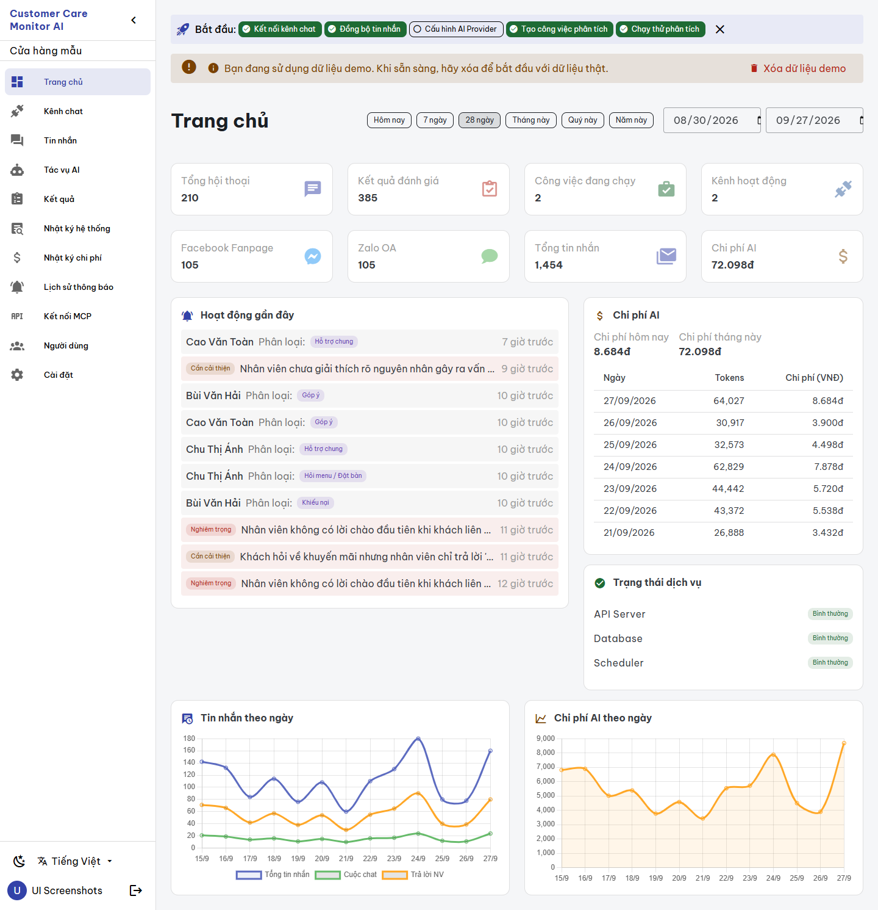
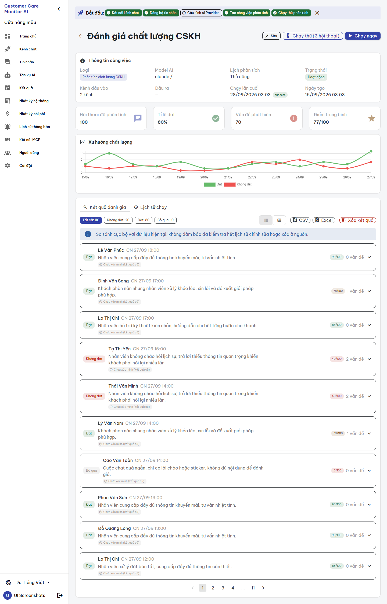
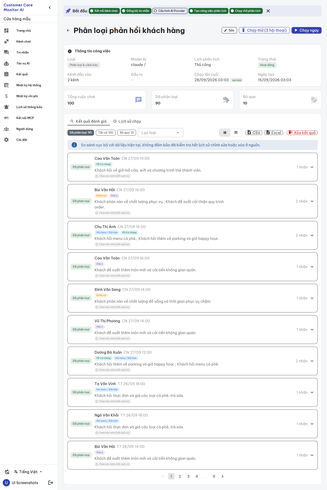

# BUILD evidence — `CCMAI-UX-001a` display data fixes

**Date:** 2026-09-28 · **Implementer:** Claude (`IMPLEMENTATION_WORKER`) · **Risk:** R2 · **Status:** `REVIEW_PENDING` for independent Codex review; not self-approved, no FREEZE.
**Authority:** [work order](../work_orders/CCMAI_UX_001A.md), [SPEC](../specs/DISPLAY_DATA_FIXES_UX001A_2026-09-28.md), plan commit `03dc93a`. **Stacked on** `CCMAI-UX-000` (`frontend/src/utils/format.ts`).

## Changes

| Finding | Change |
|---|---|
| UX-01 (frontend) | `Dashboard.vue` `timeAgo()` now delegates to `formatRelative` (UX-000) with the active locale: never negative, minutes → hours → days. |
| UX-01 (demo data) | `demo.go`: new `demoConversationStart(now, daysAgo, hour, messageCount)` places a conversation at 08:00–19:00 on a Vietnam calendar day (fixed UTC+07:00 zone, so no tzdata dependency) and moves it back one day while its last message would end after the demo runs start (`now − 2h`). New package var `demoNow` (defaults to `time.Now`) is the test seam. Nothing else in the demo writer changed. |
| UX-02 (label only) | Dashboard card label `issues` → new key `dash_results_total` ("Kết quả đánh giá") with hint `dash_results_total_hint` as a `title`. The API value and `dashboard.go` are unchanged. The recount is **BLOCKED_API_CONTRACT** (see handoff). |
| UX-03 | `JobDetail.vue` card header: `N nhãn` (`tags_count_label`) for classification jobs, `N vấn đề` for QC. |
| UX-05 | Trend grouping moved unchanged into `frontend/src/utils/trend.ts` (`qualityTrendByDay`) except the day key: `vnDateKey()` (new in `format.ts`) supplies both the grouping key and the `dd/mm` label, so they can no longer disagree. |

i18n: 3 additive keys in both languages. No API, model, migration, store or other view change.

## Gates

| Gate | Result |
|---|---|
| New Go test `TestImportDemoDataPlacesNothingInTheFuture` (disposable MySQL via `scripts/test-backend.ps1 -Run TestImportDemoData`) | PASS (with the existing `TestImportDemoDataStoresNoInventedConfidence`) |
| Mutation: pre-change `baseTime` expression restored in `demo.go` | FAIL as expected (`conversation … starts at 2026-09-19T02:00:00+07:00, outside 08:00-20:00`); source restored (byte-compared) |
| Full backend suite `scripts/test-backend.ps1` | all 13 packages `ok` |
| `go build ./...`, `go vet ./...` | clean |
| `gofmt -l` | `demo.go` is listed both at `HEAD` and after this change because of pre-existing alignment in struct literals (lines ~112–285, untouched). The added lines are gofmt-clean; the tranche does not reformat unrelated lines. `demo_test.go` clean. |
| `npx vue-tsc -b --force`, `npm run build` | pass |
| `npm test` | 7 files, 86 passed (5 new in `trend.spec.ts`) |
| Mutation: trend day key switched back to the UTC `toISOString()` date | 1 test failed; restored |
| Screenshots `ui-screenshots.ps1 -Mode app` (fixed tool, UX-000 A1) | 36 pages, 0 JS errors, 0 overflow, no external requests; disposable project removed |

## Screenshots ([assets](https://github.com/CVF-Ecosystem/Customer-Care-Monitor/tree/main/docs/reviews/assets/ux-001a-2026-09-28/))

The disposable environment imports demo data with the new placement, so the dashboard shows positive "giờ trước" values and the Job Detail trend has exactly one point per day.

## Limits and follow-ups

- Existing databases keep old demo timestamps until demo data is reset and re-imported; this tranche changed no running database.
- Relative time is computed against the viewer's clock; a skewed client clock can still show "vừa xong" for a slightly future server time (by design, never negative).
- The dashboard's own daily charts still format labels without the Vietnam-day helper; that belongs to the Dashboard screen tranche.
- **BLOCKED_API_CONTRACT:** UX-02 recount. **Needs decision:** UX-04 (Job Detail "Tất cả: 110" vs "Hội thoại đã phân tích: 100" come from different sources).

No provider call, real channel sync, customer data, persistent `ccma` change, deployment or push.
