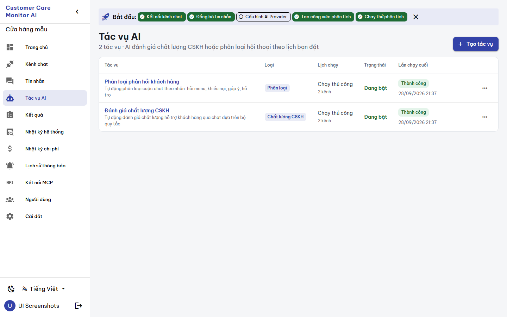
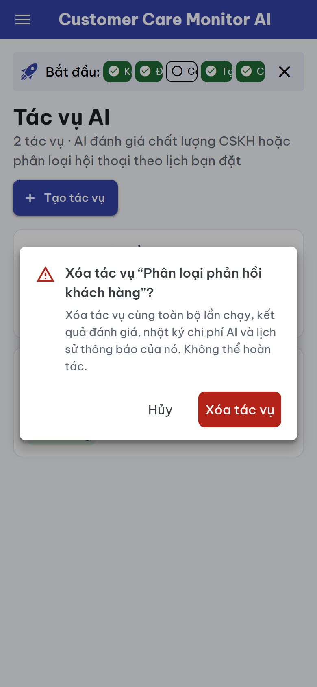
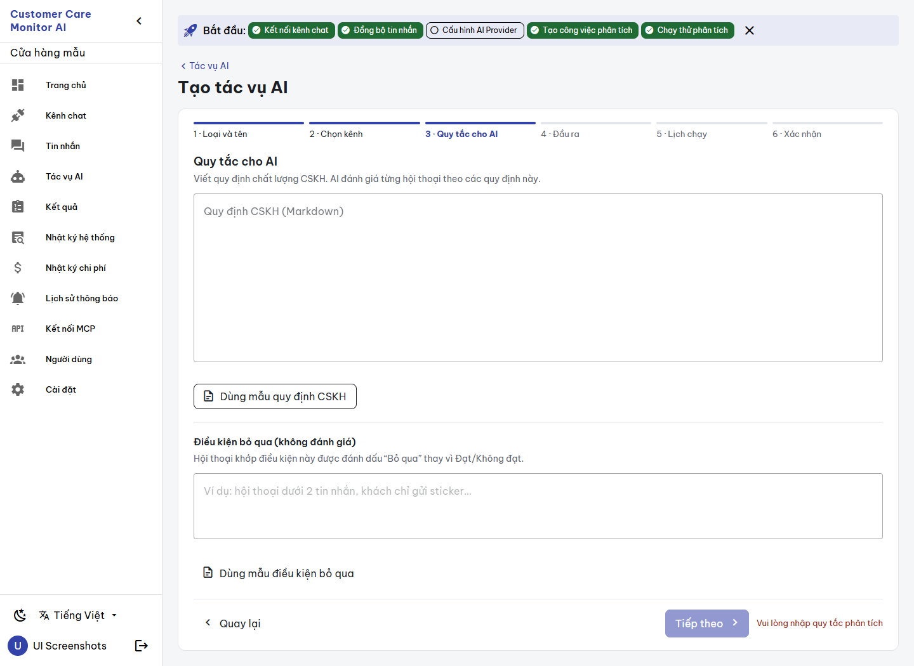
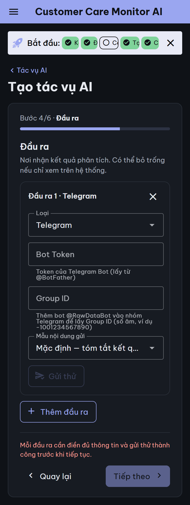
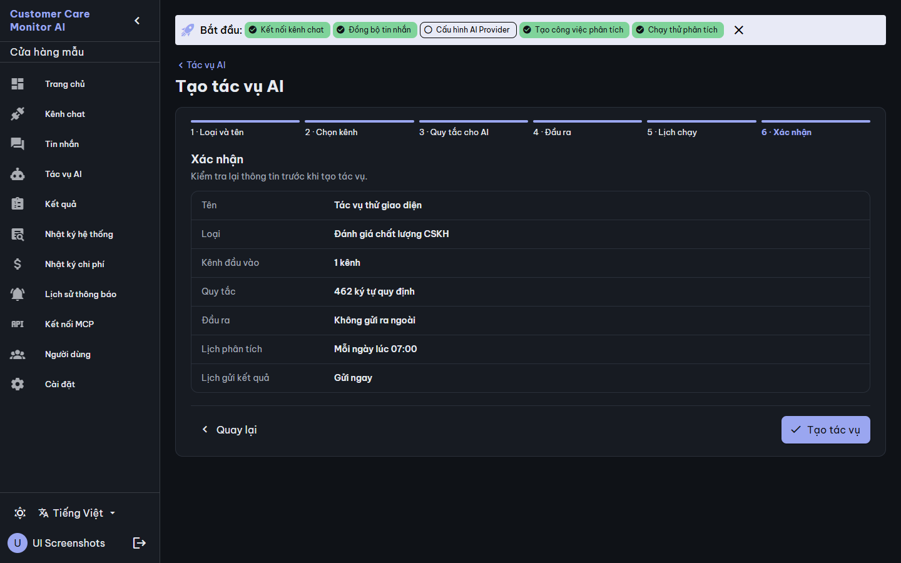
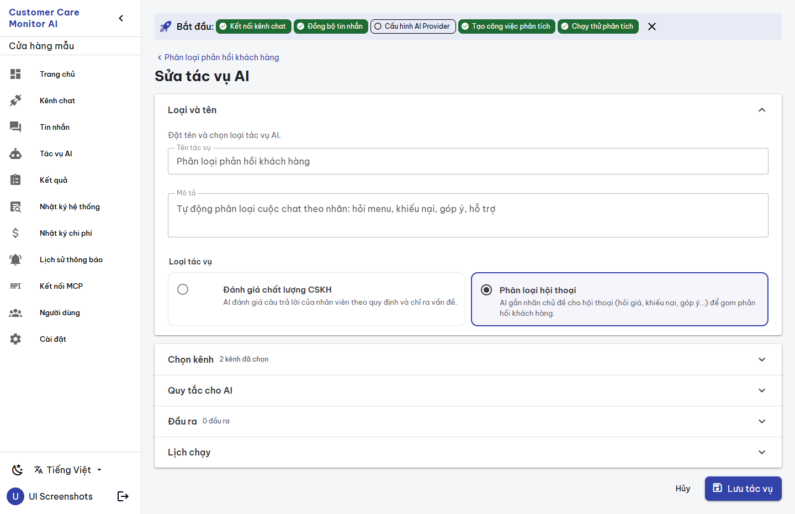

# BUILD evidence — `CCMAI-UX-013` AI job list, create and edit

**Date:** 2026-09-28 · **Worker:** Claude (`IMPLEMENTATION_WORKER`) · **Status:** `REVIEW_PENDING` for independent Codex review · **Authority:** [work order](../work_orders/CCMAI_UX_013.md), [SPEC](../specs/JOBS_SCREENS_UX013_2026-09-28.md), canvas version `1790603381-76c3` · **Risk:** R2 · **Claim boundary:** UI structure and presentation only. The tests use a mocked API and the captures use synthetic disposable data. No provider call, and no output test was sent.

**Independence:** this tranche touches only the Jobs views, the JobWizard steps, `CronPicker.vue` (used only by these views) and a new `views/Jobs/job-list/` helper. It imports reviewed UX-000 components and the reviewed `runStatusKind` from UX-010 without modifying them. It does not depend on the unreviewed UX-012 change: the two share only the additive i18n files, in separate key blocks.

## Changed files

| File | Change |
|---|---|
| `views/Jobs/JobList.vue` | Table and cards. The list shows the type, the schedule in words, the channel count, on/off state, the last-run label (UX-010 run labels) and `formatDateTime`. A labelled "⋯" menu leads to `ConfirmDialog`, which names the cascade. Adds loading, empty and load-error states. |
| `views/Jobs/JobCreate.vue` | Custom step bar (desktop), "Bước n/6" plus progress (mobile), the disabled-Next reason as `role="status"`, and a create-error alert. Steps are kept mounted with `v-show`, as the old `v-stepper` did lazily. The comment below explains why. |
| `views/Jobs/JobEdit.vue` | **Load failure no longer renders the form**: an alert with "Thử lại" replaces it. Adds a save-error alert. The payload is unchanged. |
| `components/JobWizard/Step*.vue` | Copy moved to i18n, using the "tác vụ" terms (UX-13). Type choice as option cards; the channel list with its states and an empty-state link; classification rows titled "Nhãn n"; labelled icon buttons; output test result text; the email notice; the summary step rewritten as a definition list with schedules in words. |
| `components/CronPicker.vue` | Day names follow the locale; the preview is a token note instead of an info alert. The cron it produces is unchanged. |
| `views/Jobs/job-list/schedule.ts` (new) | `describeSchedule`, `channelCount`: pure functions. |
| `i18n/vi.ts`, `en.ts` | 115 additive `jl_*` / `jw_*` keys. |
| `__tests__/jobs-screens.spec.ts` (new) | 8 tests. |

## Defects fixed and behavior notes

1. **JobEdit could overwrite a job with blanks.** When `fetchJob` failed, the old view left `loading=false` and rendered the default form (name '', rules '', schedule `0 7 * * *`), so a Save would PUT those values. The form and Save button now stay hidden until a load succeeds.
2. **Email outputs could never pass the test gate.** `/test-output` sends only Telegram (email returns 400 `unsupported output type`), but the wizard offered a "Test" button that always failed with a generic error. Email outputs now show the reason and no test button. The gate itself is unchanged (`BLOCKED_API_CONTRACT`).
3. **Changing an output's type now resets its tested flag.** Previously a Telegram output that passed its test could be switched to Email and keep "passed". This tightens the gate and loosens nothing.
4. **List dates and status (UX-12/14):** US `toLocaleString()` and an English `success` chip are replaced by `dd/mm/yyyy HH:mm` and "Thành công" / "Lỗi" / "Một phần" / "Đã hủy" / "Đang chạy" / "Không rõ" / "Chưa chạy".
5. **Delete:** the native English `confirm('Delete this job?')` is replaced by `ConfirmDialog`. Its text is backed by `DeleteJob`: runs, results, usage logs and notification logs are deleted. Edit and Delete stay visible as before (no permission-visibility change).
6. **Why `v-show` in JobCreate:** `StepOutput` marks every existing output as tested when it mounts, because the component is shared with edit mode. Remounting it when the user returns to step 4 would pass untested outputs. A test covers returning to step 4.

## Gates

| Gate | Result |
|---|---|
| `npx vue-tsc -b --force` | exit 0 |
| `npm run build` | exit 0 |
| `npm test` | 13 files, **142 passed** (134 + 8) |
| Mutation check | 4 meaningful mutations, each failing its test: `v-if` for the output step, JobEdit form rendered regardless of load, email notice removed, "Chưa chạy" mapping removed. A first JobEdit mutation turned out not to change behavior and was replaced |
| Missing-key check | Capture found a raw `jl_confirm_ok` on the delete button; the key was added and the test now asserts the button text. A script comparing used and defined `jl_`/`jw_`/`msgs_`/`jd_` keys reports none missing |
| `git diff --check`, catalog `-Check`, doctor | see the commit |

## Rendered evidence (disposable Compose project, synthetic demo data, `ccma` untouched, removed afterwards)

- `scripts/ui-screenshots.ps1 -Mode app`: 36 pages, 0 JS errors, overflow or external requests (`report-app.json`).
- A scratch CDP plan captured 7 states at desktop/mobile × light/dark: list, delete confirmation, edit, create steps 1, 3, 4 (with an untested output) and 6. Result: **28 captures, 0 JS errors, 0 overflow, 0 failed steps, 0 external requests** (`states.json`).
- Found and fixed across the capture rounds: the schedule and state cells wrapped word by word on desktop (now `nowrap`), and the missing confirm-button key.

## Held and notes

- `BLOCKED_API_CONTRACT`: an email output test.
- Not changed: Edit/Delete visibility by permission, and the `is_active` toggle.
- The onboarding bar in the layout still reads "Tạo công việc phân tích"; the layout is outside this tranche.
- The demo jobs are both "Chạy thủ công", so the other schedule wordings are covered by unit tests rather than captures.
