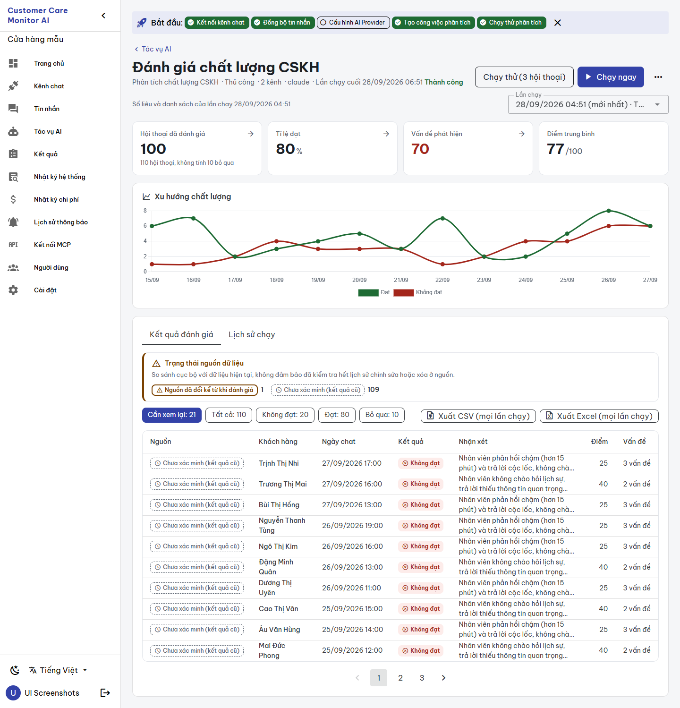
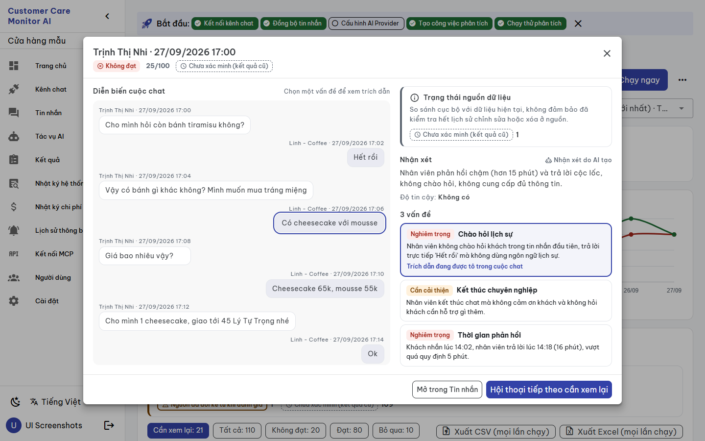
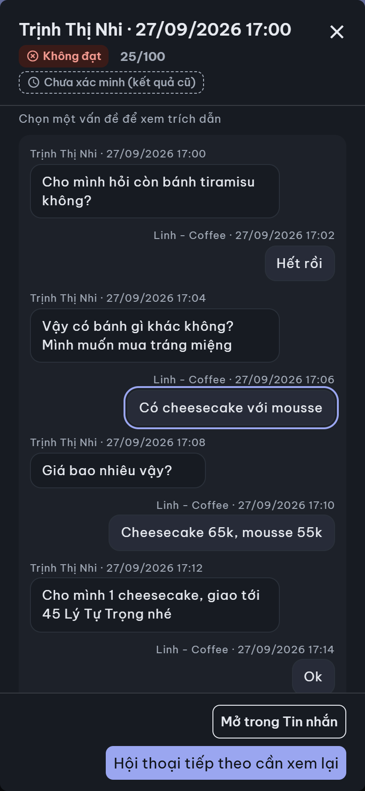
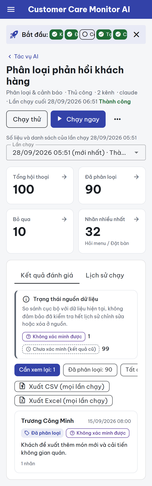

# BUILD evidence — `CCMAI-UX-010` Job Detail screen

**Date:** 2026-09-28 · **Implementer:** Claude (`IMPLEMENTATION_WORKER`) · **Risk:** R2 · **Status:** `REVIEW_PENDING` for independent Codex review; not self-approved, no FREEZE.
**Authority:** [work order](../work_orders/CCMAI_UX_010.md) (commits `1b8c3a9`, `16c42f7`), [SPEC](../specs/JOB_DETAIL_SCREEN_UX010_2026-09-28.md), canvas version `1790540352-11c7`, orchestrator decisions in the [overnight review](./UI_OVERNIGHT_BUILDS_INDEPENDENT_REVIEW_2026-09-28.md).

## What changed

| File | Change |
|---|---|
| `frontend/src/views/Jobs/JobDetail.vue` | Rewritten template/script on the UX-000 components. Kept unchanged: run dialog modes, test run, cancel, polling, AI-not-configured dialog, attachments/lightbox, deletes (API calls identical). |
| `frontend/src/views/Jobs/job-detail/logic.ts` (new) | Pure logic: `scopeResults`, `defaultScopeRunId`, `groupResults` (moved; same latest-run-per-conversation rule), `qcMetrics` (SKIP-aware, null instead of 0), `classificationMetrics`, `groupNeedsReview`, `primarySourceStatus`, `runStatusKind`, `runProgress`, `runDurationSeconds`, `evidenceRefs`/`resolveEvidence`. |
| `frontend/src/components/ui/MetricCard.vue` | Additive `suffix` prop ("%", "/100"), shown only after a known value. |
| `frontend/src/i18n/vi.ts`, `en.ts` | 75 additive `jd_*` keys. |
| Tests (new) | `job-detail-logic.spec.ts` (13), `job-detail-view.spec.ts` (5, mocked API, UI structure only), +1 `MetricCard` suffix test. |

No backend, API, model, store, other view or database change.

## Behavior against the SPEC and work-order corrections

- **Header:** back link, title, meta line (type · schedule · channels · model · last run and status). Actions: "Chạy thử", "Chạy ngay", "Dừng" while running, and `⋯` holding "Sửa tác vụ" plus the destructive "Xóa kết quả" / "Xóa lịch sử chạy". Both destructive items open `ConfirmDialog` (UX-18).
- **Live progress** is kept (work-order correction 1): "Đang phân tích analyzed/found hội thoại" from the running run's summary, and the running row in run history shows `analyzed / found`.
- **Scope:** defaults to the most recent run that has results, with the caption "Số liệu và danh sách của lần chạy <time>". The selector lists runs with results and "Mọi lần chạy" (the previous behavior). Metrics, trend, source panel, filters and list all follow the scope. When a new run finishes, an untouched latest-run scope moves to it; "Xem kết quả" in run history selects that run.
- **UX-04 (correction 2):** "Hội thoại đã đánh giá: 100" carries the hint "110 hội thoại, không tính 10 bỏ qua". Pass rate and average score show "—" (not 0) when nothing was evaluated or scored.
- **Metric drill-down:** real links (`?filter=`) that apply the filter within the current scope.
- **Source panel** above the list: each conversation counted once, under its most concerning status. The local-only note is always shown. All-legacy scopes add the rerun explanation.
- **Filters:** "Cần xem lại" is first and the default when its count > 0 (QC: failures plus changed/unverifiable sources; classification: sources only). Tag chips for classification. `FilterBar` scrolls sideways on mobile.
- **List:** desktop table with a "Nguồn" column of `SourceStatusChip`s (every status, glossary labels), `VerdictChip`, score, issue/tag count; changed-source rows get a left warning bar. Mobile uses `ResultCard`. Rows are keyboard-openable (Enter).
- **Export:** "Xuất CSV (mọi lần chạy)" / "Xuất Excel (mọi lần chạy)" (orchestrator decision; endpoint unchanged).
- **Detail dialog** (`AppDialog`; full screen on mobile, Esc closes, close button). Left: transcript. Right: source panel, review with "Nhận xét do AI tạo", `ConfidenceText`, issues as buttons. Selecting an issue outlines and scrolls to the messages resolved from `detail.evidence_refs` (`message_id` + exact `quote`). Otherwise it states "Không tìm thấy trích dẫn trong hội thoại hiện tại". The old substring-guess highlight is removed. Footer: "Mở trong Tin nhắn", "Hội thoại tiếp theo cần xem lại".
- **Run history:** start, status chip (running/success/partial/error/cancelled/unknown), duration ("—" while running), conversations, summary or error message, "Xem kết quả" for runs with results, and the note that "Đang chạy" means accepted, not finished (R009).
- **States:** loading skeleton; never-run empty state with actions; load error `role="alert"` with "Thử lại"; dark mode via tokens; trend colors from theme `pass`/`fail`.

## Gates

| Gate | Result |
|---|---|
| `npx vue-tsc -b --force` | exit 0 |
| `npm run build` | pass |
| `npm test` | 10 files, **111 passed** (i18n parity included) |
| Mutation: default scope forced to "Mọi lần chạy" and default filter to "all" | 2 view tests failed as expected; source restored |
| `git diff --check` | clean |
| Catalog `-Check` / doctor | PASS / 25/25 (after continuity sync) |

## Rendered evidence (disposable environment, isolated DNS, synthetic demo; removed afterwards, `ccma` untouched)

- `ui-screenshots.ps1 -Mode app` on the final code: 36 pages (both job details at desktop/mobile × light/dark), **0 JS errors, 0 horizontal overflow, no external requests** (`report-app.json`).
- A scratch CDP script (not committed) opened the first listed conversation, selected its first issue, closed with Esc and opened run history, at desktop/mobile × light/dark. It found 0 new JS errors, Esc closed in all four cases, and run history rendered "Thành công".
  - Demo data has no `evidence_refs`, so every case showed "Không tìm thấy trích dẫn…" (`states-no-refs.json`).
  - To render the positive path, the **disposable** DB's 70 demo violations were given one synthetic reference each (first agent message ≥ 20 characters, first 20 characters as the exact quote). All four cases then showed "Trích dẫn đang được tô…" with the quoted message outlined (`states-synthetic-refs.json`).
- A defect seen in the first capture round was fixed before the final capture: the explanation duplicated the evidence text in demo data. The explanation now renders only when it differs.

Images in [`assets/ux-010-2026-09-28/`](./assets/ux-010-2026-09-28/):

## Limits and notes for review

- The latest-run default is implemented as decided; its rationale is now scope clarity (work-order correction 3). Please confirm.
- Demo `job.last_run_at` (import time) differs from the demo run's `started_at` (two hours earlier), so the header "Lần chạy cuối" and the scope caption show different times in demo data. Both are shown as stored; this is not a UI computation.
- The run dialog and AI-not-configured dialog copy is unchanged Vietnamese text (not moved to i18n in this tranche).
- Findings F1 (onboarding banner) and F3 (older status styling in other views) remain with later screen tranches.

No provider call, real channel sync, customer data, persistent DB change, deployment or push.
