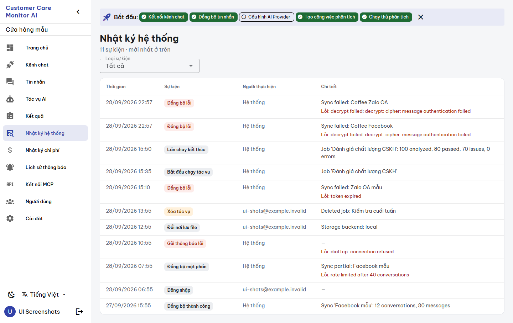
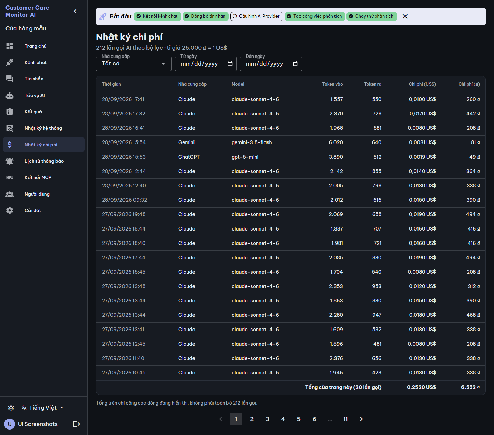
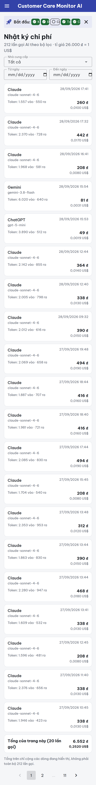
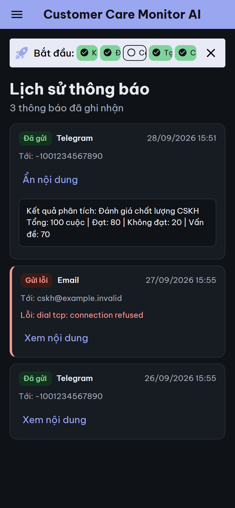
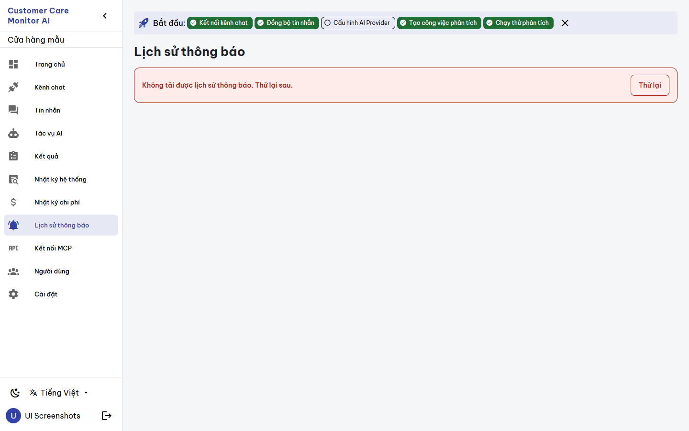
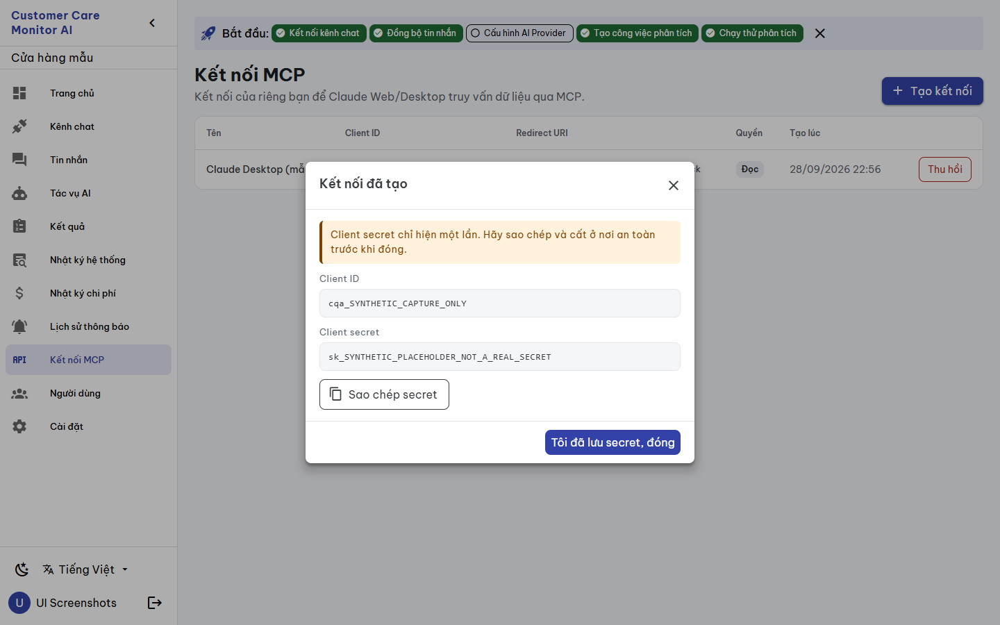
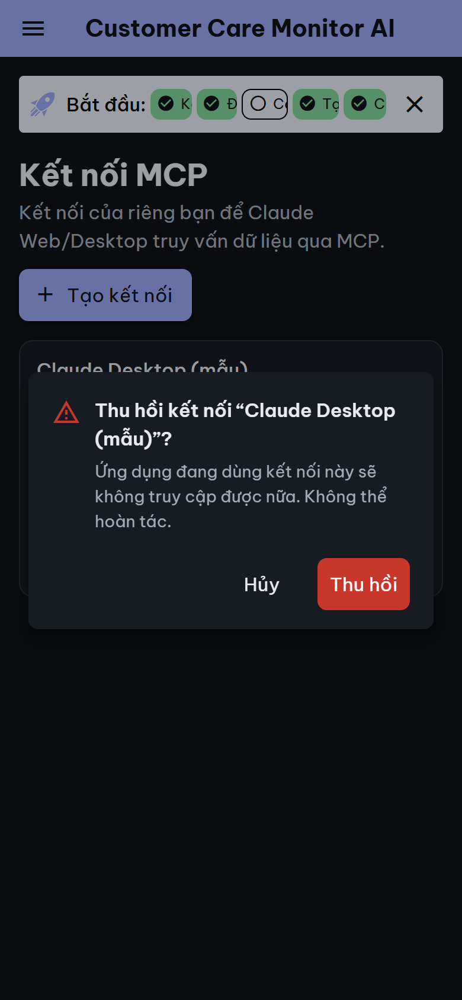

# BUILD evidence — `CCMAI-UX-015` Activity logs, cost logs, notification history and MCP connections

**Date:** 2026-09-28 · **Worker:** Claude (`IMPLEMENTATION_WORKER`) · **Status:** `REVIEW_PENDING` for independent Codex review · **Authority:** [work order](../work_orders/CCMAI_UX_015.md), [SPEC](../specs/LOGS_COST_NOTIFY_MCP_UX015_2026-09-28.md), canvas version `1790608303-0cb6` · **Risk:** R2 · **Claim boundary:** UI structure and presentation only. The tests use a mocked API and the captures use synthetic disposable data. No provider call or notification send was made. No real MCP client secret appears: the secret capture used an intercepted, synthetic create response.

**Independence:** only the four views and the additive `lg_*`/`mc_*` keys changed. The UX-000 components `AppDialog` and `ConfirmDialog` are imported without modification, and the `ui_cancel` key is reused. No UX-012..014 key is used, so the tranche does not depend on UX-014, which is still under repair.

## Changed files

| File | Change |
|---|---|
| `views/ActivityLogs.vue` | Subtitle with the event count and a labelled "Loại sự kiện" filter. The filter now includes `settings`, which covers `settings.storage`. Vietnamese labels are shown for all 13 actions actually written, and an unknown action is shown raw. The actor shows "Hệ thống" for `system` or an empty value. Detail and error text appear verbatim. The view has a desktop table, mobile cards, a skeleton, error + retry, and separate empty and filtered-empty states. A filter change returns to page 1, and stale responses are ignored. |
| `views/CostLogs.vue` | The provider filter lists Claude, Gemini, ChatGPT and Grok (values `claude`/`gemini`/`openai`/`xai`). The subtitle shows the count and exchange rate. Costs show 4 decimals in US$ and whole ₫, with tabular numbers. **The footer reads "Tổng của trang này (n lần gọi)"**, and a note says it is not the total of all matching calls. Other changes: mobile cards, error + retry, and a filter change returns to page 1. |
| `views/NotificationLogs.vue` | **A load failure now shows an alert with "Thử lại"** (it used to show "Chưa có thông báo nào"). Status is shown as Đã gửi / Gửi lỗi, and the channel as Telegram / Email. A toggle with `aria-expanded`/`aria-controls` reveals the subject and body in a token-coloured block (previously `bg-grey`/`white`, unreadable in dark mode). Also: `dd/mm/yyyy hh:mm` dates and mobile cards. |
| `views/MCPConnections.vue` | The subtitle says the connections belong to the signed-in user. **A load failure is no longer shown as the empty state.** Revoke uses `ConfirmDialog` and reports failure (previously a native `confirm` whose errors were swallowed). Scopes are labelled Đọc / Ghi, with values unchanged. The create dialog uses `AppDialog`, and the secret view shows a warning, "Sao chép secret" and "Tôi đã lưu secret, đóng". Closing by any route clears the secret from page memory. A clipboard failure is reported, and error snackbars are no longer green. The create payload is unchanged. |
| `i18n/vi.ts`, `en.ts` | 93 additive keys each. |
| `__tests__/logs-mcp.spec.ts` (new) | 8 tests. |

## Defects fixed

1. **Cost footer:** the table summed only the 20 visible rows but labelled the result "Tổng" beside a filter covering hundreds of calls. It now says "Tổng của trang này", with a note. The filtered grand total is `BLOCKED_API_CONTRACT`.
2. **Provider filter:** it offered only claude/gemini, while openai/xai calls are also logged.
3. **Hidden load failures:** notification and MCP load failures looked like "nothing yet".
4. **Action filter:** it missed `settings.storage`, and raw action codes were shown in English.
5. **MCP errors:** revoke errors were silent, and error snackbars used the success colour.
6. **Stale page after filtering:** changing a filter on page N kept page N.
7. **Formatting:** US-style `toLocaleString()` dates and hard-coded light colours were replaced.

## Gates

| Gate | Result |
|---|---|
| `npx vitest run src/__tests__/logs-mcp.spec.ts` | 8/8 |
| `npm test` | 15 files, **159 passed** (151 + 8) |
| `npx vue-tsc -b --force` | exit 0 |
| `npm run build` | exit 0 |
| Mutation check | 4/4 caught: notification failure treated as loaded; filter keeping the page; revoke without confirmation; secret not cleared on close |
| Undefined-key check | none among keys used by the four views |
| `git diff --check`, catalog `-Check`, doctor | see the commit |

## Rendered evidence (disposable Compose project `ccma-uishot-20260928225128`, synthetic data, `ccma` untouched, removed afterwards)

- `scripts/ui-screenshots.ps1 -Mode app -KeepEnvironment`: 36 pages, 0 JS errors, overflow or external requests (`report-app.json`). That script's routes do not include the four UX-015 screens.
- Synthetic rows were seeded into the disposable database only: 9 activity rows, 3 notification rows (one failed email) and 2 usage rows (Gemini, ChatGPT). One MCP client was created through the disposable API, and its secret was never displayed or stored.
- After a mobile layout fix to the cost filters and cards, the app service was rebuilt. A scratch CDP plan then captured 7 states at desktop/mobile × light/dark: activity logs, cost logs, an expanded notification, a notification load failure (request failed through CDP `Fetch`), the MCP list, the MCP secret dialog (create response intercepted with a synthetic `sk_SYNTHETIC_PLACEHOLDER_NOT_A_REAL_SECRET`) and the revoke confirmation (not confirmed). Result: **28 captures, 0 JS errors, 0 overflow, 0 failed steps, 0 external requests** (`states.json`).
- Date filter inputs are native `type="date"`, so their placeholder follows the browser locale. The headless Chrome used en-US and shows `mm/dd/yyyy`; this is unchanged from before.

## Held (SPEC §5)

- A filtered grand total for costs (`BLOCKED_API_CONTRACT`).
- Vietnamese text for server-written log details.
- A permission on the notification-log route.
- MCP connections per company instead of per user.
