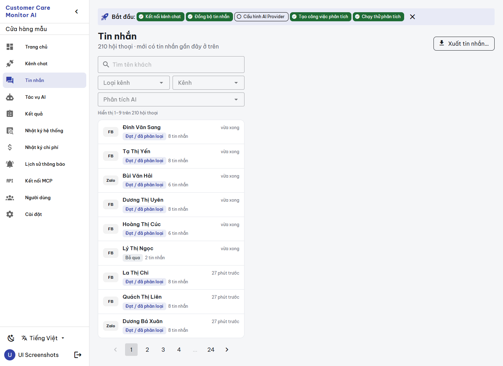
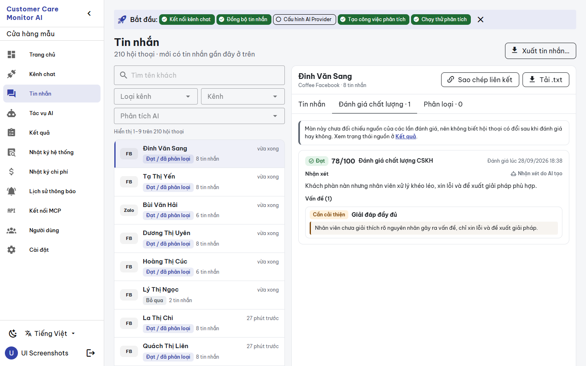
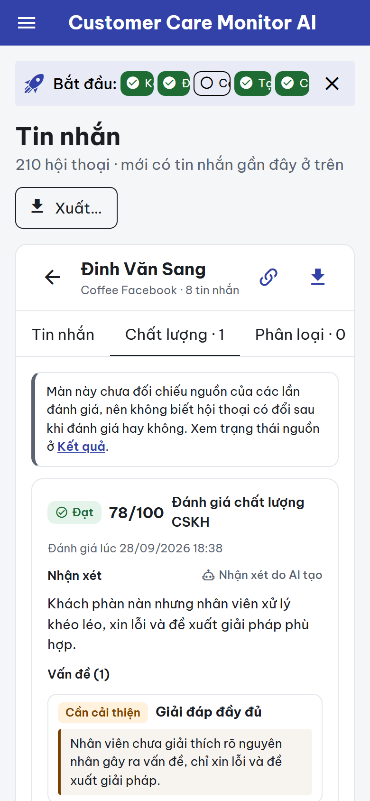
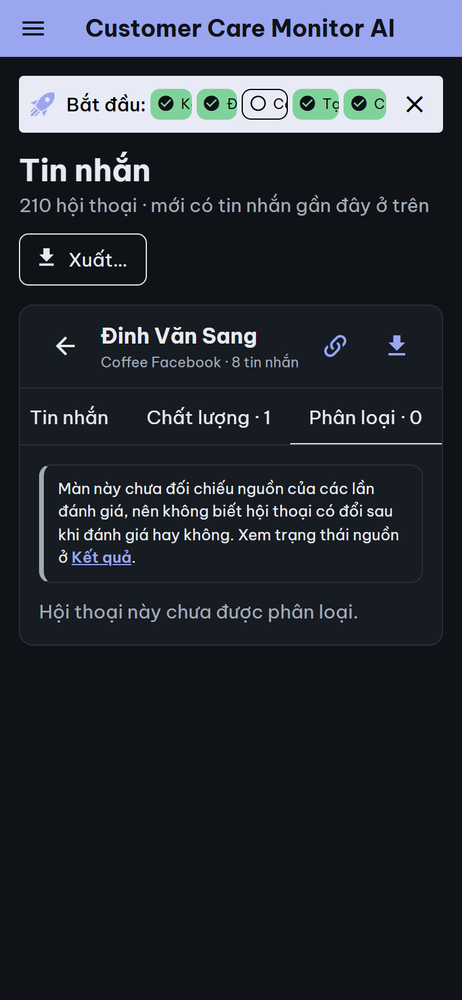
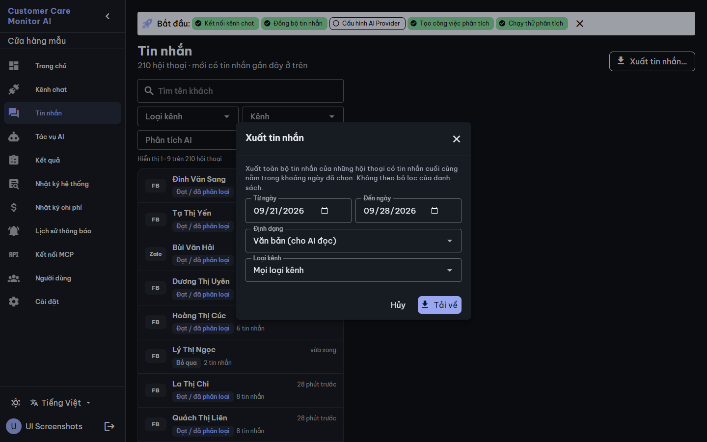

# BUILD evidence — `CCMAI-UX-012` Messages screen redesign

**Date:** 2026-09-28 · **Worker:** Claude (`IMPLEMENTATION_WORKER`) · **Status:** `REVIEW_PENDING` for independent Codex review · **Authority:** [work order](../work_orders/CCMAI_UX_012.md), [SPEC](../specs/MESSAGES_SCREEN_UX012_2026-09-28.md), canvas version `1790601057-3d67` · **Risk:** R2 · **Claim boundary:** UI structure and presentation only; mocked-API tests and synthetic disposable data; no governance claim and no provider call.

**Independence:** depends only on reviewed work (UX-000 components and utils, which are imported and not modified). It changes no shared component, so UX-013..015 do not depend on it.

## Changed files

| File | Change |
|---|---|
| `frontend/src/views/Messages.vue` | Template/style rewrite on theme tokens. Every request, its parameters, the debounce, deep links and paging (9 per page) are unchanged. New: honest analysis chips, a range caption, "Xóa lọc", list and conversation error states with retry, a mobile filter sheet, an `AppDialog` export dialog with its selection rule, detection of the 200 JSON `{error}` export body, a clipboard failure toast, the source-status note on both evaluation tabs, and the SKIP run showing no issue section. |
| `frontend/src/i18n/vi.ts`, `en.ts` | 60 additive `msgs_*` keys each. |
| `frontend/src/__tests__/messages-screen.spec.ts` (new) | 7 tests. |

## Defects fixed (presentation only)

1. **UX-16:** the heading count was conversations labelled as messages. It now reads "210 hội thoại".
2. **List chip truth:** the old chip showed "Không đạt" for SKIP and classification-only results, and "Đạt" for classification PASS. The engine writes classification evaluations as `PASS` (`engine/analyzer.go`), and the evaluated map has no job type. Mapping is now: PASS → "Đạt / đã phân loại", FAIL → "Không đạt", SKIP → "Bỏ qua", missing → "Chưa phân tích", anything else → "Đã phân tích". The filter options name the same scope ("Lần gần nhất: …").
3. **Export with no data:** the server answers 200 with `{"error": …}`. The old view saved that JSON as a `.txt`/`.csv` file. The error is now shown as a toast.
4. **Unhandled load errors:** the list or a conversation now shows `role="alert"` with "Thử lại".
5. **Tab labels, strings and colors:** all copy is in i18n; tags use the theme primary tint instead of 10 random hex colors, and bubbles use theme tokens.

## Gates

| Gate | Result |
|---|---|
| `npx vue-tsc -b --force` | exit 0 |
| `npm run build` | exit 0 |
| `npm test` | 12 files, **134 passed** (127 + 7) |
| Mutation check | Restored the old chip mapping, removed JSON-error detection and removed the list error state. Each broke its test (3/3); source restored |
| `git diff --check`, catalog `-Check` | clean / PASS |
| Project doctor | 25/25 PASS |

## Rendered evidence (disposable Compose project, synthetic demo data, `ccma` untouched, removed afterwards)

- `scripts/ui-screenshots.ps1 -Mode app`: 36 pages, 0 JS errors, 0 overflow, 0 external requests (`report-app.json`).
- A scratch CDP plan (not committed) captured six states at desktop/mobile × light/dark: list, open conversation, quality tab, classification tab, export dialog and no-match. Result: **24 captures, 0 JS errors, 0 overflow, 0 failed steps, 0 external requests** (`states.json`). The list step also asserted that "(210)" no longer appears.
- A first capture round found two layout issues, fixed before the final round: the three conversation tabs overflowed at 390 px (the mobile quality tab is now "Chất lượng · n"), and a SKIP run still showed "Vấn đề (0)".

## Held — `BLOCKED_API_CONTRACT` (SPEC §5)

A QC-only "Đạt" chip or filter (the evaluated map and filter lack the job type); source-integrity status for conversation evaluations; a total message count; a job link per evaluation group (no job id).

## Notes for review

- The native date inputs in the export dialog follow the **browser** locale. The headless capture runs in en-US and shows MM/DD/YYYY; a vi-VN browser shows dd/mm/yyyy. Same as the Results filters, and not changed here.
- The downloaded `.txt` of one conversation keeps its existing Vietnamese content (file content, not UI).

## Repair R1 (Claude, `REPAIR_WORKER`, 2026-09-28)

**Finding R1-1** ([review](CCMAI_UX_012_INDEPENDENT_REVIEW_2026-09-28.md)): when `GET /conversations/evaluated` failed, every conversation showed "Chưa phân tích", even analyzed ones.

**Fix** (`Messages.vue`, one additive key `msgs_chip_unknown`): the map now has an explicit state (`pending` / `ok` / `error`).
- `ok`: the PASS/FAIL/SKIP/other/absent mapping is unchanged, and an absent entry is still "Chưa phân tích".
- `pending`: no chip is shown.
- `error`: a muted "Không rõ trạng thái phân tích" chip is shown.

The request parameters are unchanged.

**Tests:** 3 regression cases in `messages-screen.spec.ts`: failed request (4 rows, all "Không rõ…", never "Chưa phân tích"), pending request (no chip), and a successful map with absent entries ("Chưa phân tích"). Mutating the error branch back to "loaded, empty" fails the failure case. Suite: **145/145**; `vue-tsc` and build pass.

**Captures:** none were taken for this repair. The failure state needs a failing status endpoint, which the disposable environment cannot produce without changing the backend. The success-path rendering is unchanged from the BUILD captures.

Status: `REVIEW_PENDING` for Codex re-review. No push or FREEZE.
