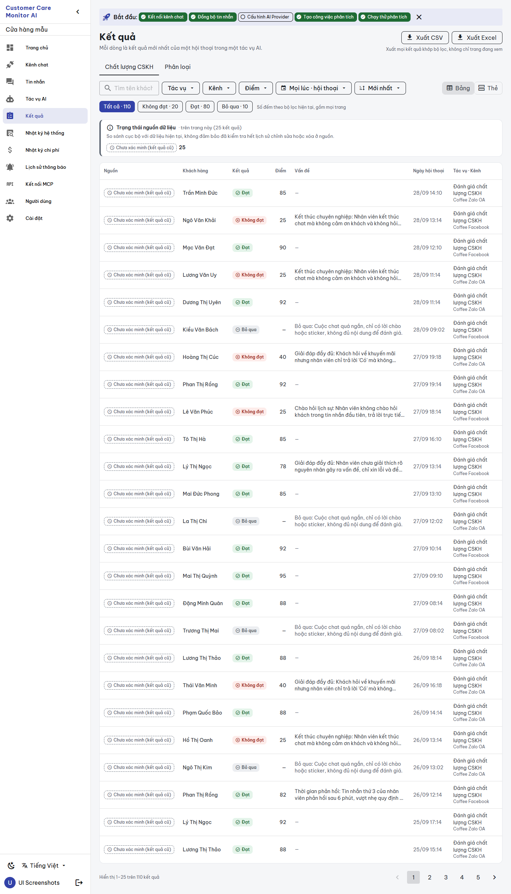
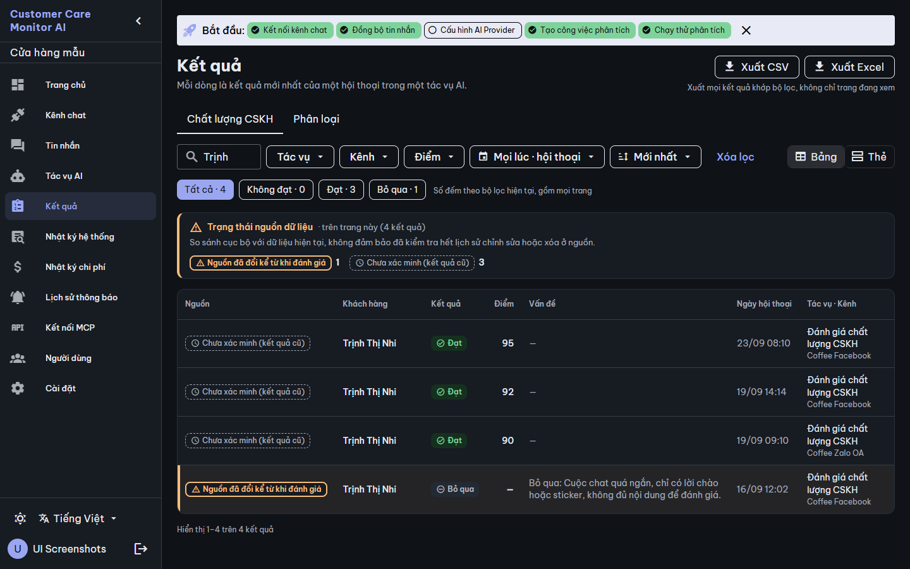
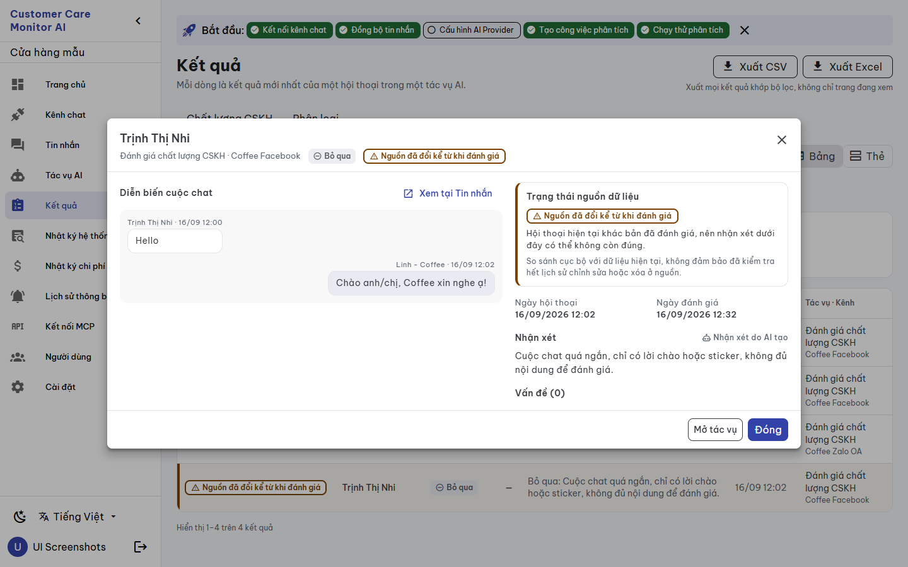
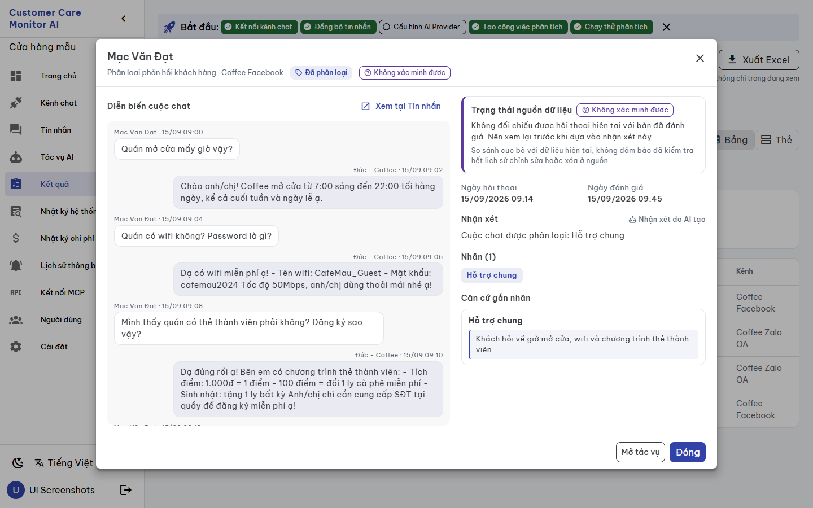
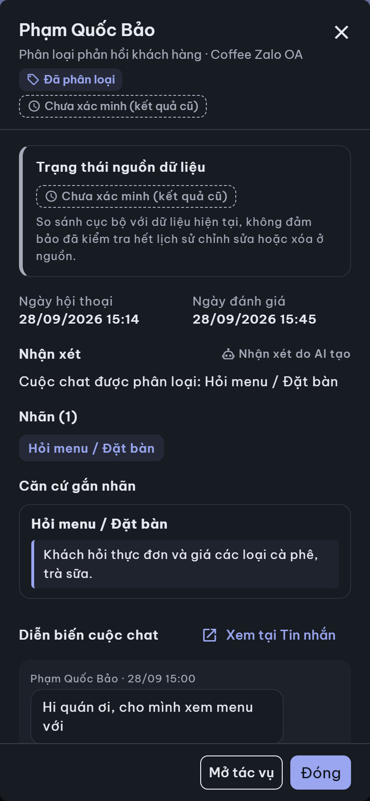


# BUILD evidence — `CCMAI-UX-011` Results screen redesign

**Date:** 2026-09-28 · **Worker:** Claude (`IMPLEMENTATION_WORKER`) · **Status:** `REVIEW_PENDING` for independent Codex review · **Authority:** [work order](../work_orders/CCMAI_UX_011.md), [SPEC](../specs/RESULTS_SCREEN_UX011_2026-09-28.md), canvas version `1790597255-fb44` · **Risk:** R2 · **Claim boundary:** UI structure and presentation only. The tests use a mocked API and the captures use synthetic disposable data. Nothing here is evidence that CVF governs AI behavior, and no provider was called.

## Changed files

| File | Change |
|---|---|
| `frontend/src/views/Results.vue` | Template/style rewrite on UX-000 components (`FilterBar`, `SourceStatusPanel`, `SourceStatusChip`, `VerdictChip`, `ResultCard`, `AppDialog`, `AiGeneratedLabel`). The script keeps the same filter state, `thamSo()`, debounce, page/tab reset rules, list/facets/export calls and too-large handling. New: inline load-error state with retry (`loiTai`), card/dialog summaries, per-status dialog hints, and debounce timer cleared on unmount. |
| `frontend/src/components/ui/SourceStatusPanel.vue` | One additive optional prop `scope` rendered after the title. Without it the panel is unchanged, so Job Detail is unaffected. |
| `frontend/src/i18n/vi.ts`, `en.ts` | 23 additive `results_*` keys each; no existing value changed. |
| `frontend/src/__tests__/results-screen.spec.ts` (new) | 12 focused tests (below). |
| `frontend/src/__tests__/results-source-note.spec.ts` | Selectors only: the note is now inside `SourceStatusPanel`, and cards are `ResultCard`. The three UX-002 assertions keep their meaning. |
| `frontend/src/__tests__/ui-components.spec.ts` | One test: `scope` absent → nothing rendered; present → shown, and the note is still there. |

No backend, API, store, composable, util, other view or repository script was changed.

## What the screen now does (SPEC §2)

- **Header:** a subtitle states the row scope (the latest result per conversation and job, from the `baseQuery` "latest" join). Export buttons carry the caption "Xuất mọi kết quả khớp bộ lọc, không chỉ trang đang xem", which matches `ExportResults` (full filter, including the verdict). On mobile they sit in one "Xuất" menu with the same caption.
- **Verdict chips:** these are in a `FilterBar` with `aria-pressed` and the caption "Số đếm theo bộ lọc hiện tại, gồm mọi trang", which matches `verdictCounts` (all filters except the verdict, no pagination).
- **Source panel:** the shared `SourceStatusPanel` has the scope "trên trang này (n kết quả)", because the server computes status only for the returned page. The panel shows the local-only note and uses alert styling when a row on the page changed. It is shown only when rows exist.
- **Table:** a visible "Nguồn" header and a text source chip on every row (UX-09). Changed rows have an edge and a tint; unavailable rows have an edge. Rows are keyboard-operable (Enter/Space). Classification shows tag chips under "Nhãn". SKIP rows read "Bỏ qua: {lý do}". *Build detail:* "Tác vụ · Kênh" is one two-line column. With separate columns, the channel column was clipped inside the table at 1440 px with the sidebar open. Both values are still shown at ≥ lg.
- **Cards** (mobile, or "Thẻ" on desktop): `ResultCard` opens the dialog. The in-place expansion is gone, and its transcript moved to the dialog. It uses the same `useChatTranscript` messages call, now made when the dialog opens.
- **Range:** "Hiển thị a–b trên n kết quả" comes from `page` and the server `total`.
- **Dialog:** customer as the title; "tác vụ · kênh"; verdict, score and source chips; a source block with the hint for changed/unavailable and the local-only note; the two dates; "Nhận xét" with the AI label. QC shows "Vấn đề (n)" with severity and quoted evidence. Classification shows "Nhãn (n)" and "Căn cứ gắn nhãn" and never uses "Vấn đề" or pass/fail. The transcript comes with "Xem tại Tin nhắn", plus "Mở tác vụ" and "Đóng". It is full screen on mobile and closes with Esc. **No confidence is shown** (`/results` has none).
- **States:** facets or list load error → `role="alert"` with "Thử lại". A facets error no longer falls through to the "no jobs" card, which the old view did because the facet counts stayed at zero. No match → "Xóa lọc" button. Other empty states keep their copy.

## Gates

| Gate | Result |
|---|---|
| `npx vue-tsc -b --force` | exit 0 |
| `npm run build` | exit 0 |
| `npm test` | 11 files, **127 passed** (114 before + 12 Results + 1 panel; i18n parity included) |
| Mutation check: removed the panel scope, forced the QC issue list on classification, removed the unavailable hint, changed `page_size` to 50, and fixed the range start at 1 | 4 tests failed as expected. The range-start mutation was invisible on page 1, so a page-2 range test was added (26–28 of 60). Source restored, 12/12 pass |
| Flake found and fixed | A classification test left a pending 250 ms debounce that fired into the next test after unmount. The view now clears the timer on unmount (this also stops a stray request when leaving the page). 5 consecutive reruns pass |
| `git diff --check` | clean |
| Catalog `-Check` | PASS after continuity sync |
| Project agent-enforcement doctor | **24/25 — FAIL** on "CVF public core matches origin/main": `BEHIND_PUBLIC_REMOTE` (local pin `19386f6…`, public `origin/main` `26c686c…`). The fix (`update_cvf_workspace_public_core.ps1`) re-pins `.cvf/manifest.json`, which is a governance change outside this frontend work order, so it was **not** run. The orchestrator or owner decides. All other 24 checks pass, including worktree clean and manifest commit match. |

Focused tests (UI-only mocks): page-scoped panel counts, scope and alert; text source chips and row marking; count, range and export scope captions; unchanged `/results` and `/results/export` parameters, including a verdict change; the QC dialog (changed hint, note, issues, no confidence, AI label, transcript request); unavailable vs legacy hints; classification dialog labels; card view; list load error with retry; facets error not shown as "no jobs"; no match with "Xóa lọc".

## Rendered evidence (disposable Compose project, synthetic demo data, isolated from `ccma`; removed afterwards)

- `scripts/ui-screenshots.ps1 -Mode app` on the final code: **36 pages, 0 JS errors, 0 horizontal overflow, 0 external requests** (`report-app.json`).
- A scratch CDP script (not committed) searched for the seeded changed-source customer and opened the row. Then it opened a classification result, at desktop/mobile × light/dark (`states-final.json`). In all four cases: panel alert on, changed row marked, dialog hint and note present, transcript loaded, **no confidence element**, Esc closed the dialog, the classification dialog had tags and no issue list, no page overflow, 0 JS errors.
- The seeded `verification_unavailable` row landed on a QC result in the final run, while the script looked for it on the classification tab, so the final run did not open it. The unavailable captures come from the previous run of the same dialog code (`states-unavailable-run.json`), where it was a classification result. All four cases showed the unavailable hint with 0 JS errors. Between that run and the final one, only the table column CSS changed.

Images in [`assets/ux-011-2026-09-28/`](./assets/ux-011-2026-09-28/):

## Held (not built) — `BLOCKED_API_CONTRACT`, SPEC §5

"Cần xem lại" and source-status filters, global source counts, confidence on Results, transcript quote highlighting, and page- or run-scoped export. Dashboard `qc_violation_count`, demo scheduler/sync and every backend/API/store/schema/provider change remain outside UX-011.

## Notes for review

- In demo data every result is legacy except the two seeded rows. The panel therefore usually shows "Chưa xác minh (kết quả cũ) 25" with no alert.
- Desktop defaults to "Bảng" and remembers the choice in `cqa_results_view` as before. Reading the key is now wrapped in try/catch, and an unknown value falls back to the table.
- Mobile always uses cards (unchanged rule).
