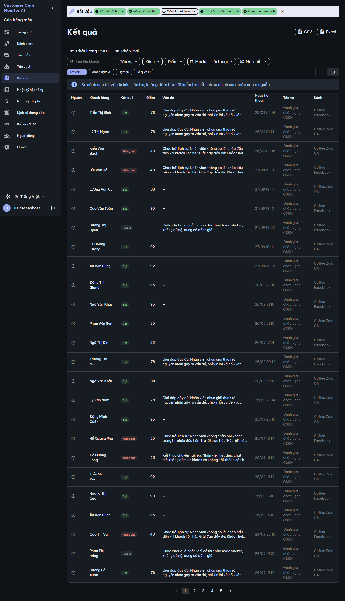


# BUILD evidence — `CCMAI-UX-002` Results source note and column header

**Date:** 2026-09-28 · **Implementer:** Claude (`IMPLEMENTATION_WORKER`) · **Risk:** R2 · **Status:** `REVIEW_PENDING` for independent Codex review; not self-approved, no FREEZE.
**Authority:** [work order](../work_orders/CCMAI_UX_002.md), [SPEC](../specs/RESULTS_SOURCE_NOTE_UX002_2026-09-28.md), plan commit `1a70ea4`. Finding UX-07.

## Change

`frontend/src/views/Results.vue`, template only (+13/−3):

- Table branch: `<v-card v-else-if="xemBang">` became `<template v-else-if="xemBang">` holding a `v-alert` with `results_source_note` followed by the unchanged card/table. The inner table lines keep their old indentation to keep the diff reviewable.
- Card branch: the same `v-alert` is the first child of `
`, before the first result card.
- Source column header: the empty `<th>` with `aria-label`/`title` now shows the visible text `results_col_source` ("Nguồn"); width 40 → 64px so the word fits.
- Loading, "no run yet", "no match" and "company without jobs" states are untouched, so they show no note (SPEC S2). The dialog keeps its own note. No script, i18n, API, store or other view change.

The markup matches the reviewed Job Detail R006-R1 note (`v-alert type="info" variant="tonal" density="compact"`). It will be replaced by the shared `SourceStatusPanel` when the Results redesign tranche adopts UX-000.

## Gates

| Gate | Result |
|---|---|
| `npx vue-tsc -b --force` | exit 0 |
| `npm run build` | built |
| `npm test` | 6 files, 81 passed (3 new in `results-source-note.spec.ts`) |
| Mutation check: the new spec run against `HEAD:frontend/src/views/Results.vue` (pre-change) | 2 failed (table note/header, card note), 1 passed (the empty-state test, which the old source also satisfies); restored → 3 passed |
| `git diff --check` | clean |
| Catalog `-Check` / workspace doctor | PASS / PASS 25/25 (after continuity sync) |

The new test mounts `Results.vue` with the `api` module mocked (`vi.mock('../api')`). It checks UI structure only, which policy allows (`mockAllowedOnlyForUi`); it is not governance evidence.

## Screenshots

`scripts/ui-screenshots.ps1 -Mode app` (disposable Compose, synthetic demo data; removed afterwards, persistent `ccma` untouched): 36 pages, 0 JS errors, 0 horizontal overflow, no external requests. The Results captures are in [`assets/ux-002-2026-09-28/`](https://github.com/CVF-Ecosystem/Customer-Care-Monitor/tree/main/docs/reviews/assets/ux-002-2026-09-28/) with `report-results.json`.

These captures run on the current tree, which includes the UX-000 theme and font (still REVIEW_PENDING). UX-002 does not depend on UX-000: the change uses only existing Vuetify components and i18n keys, and the component test runs against the default Vuetify theme.

## Boundaries

No provider call, real channel sync, customer data, persistent DB change, deployment or push.
