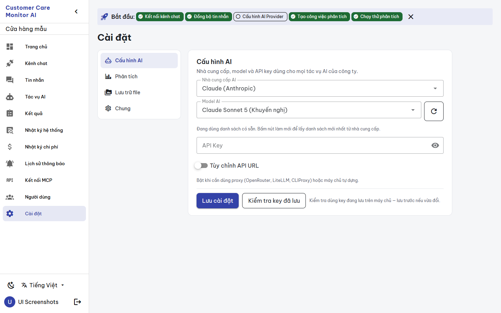
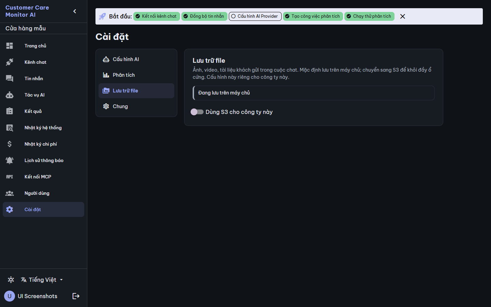
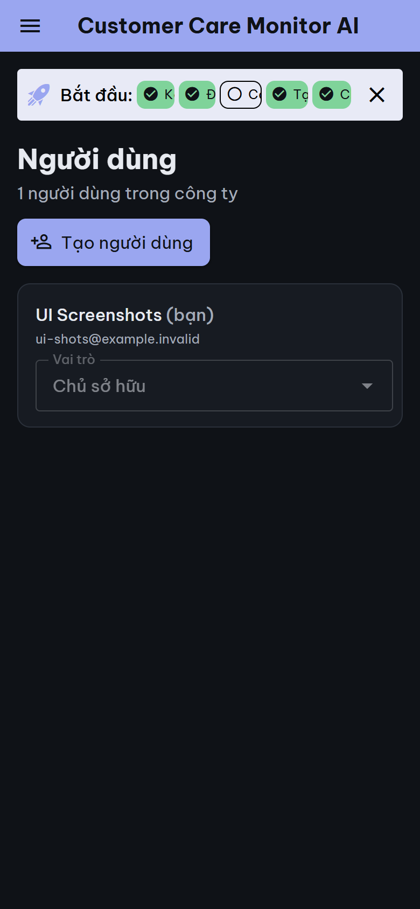
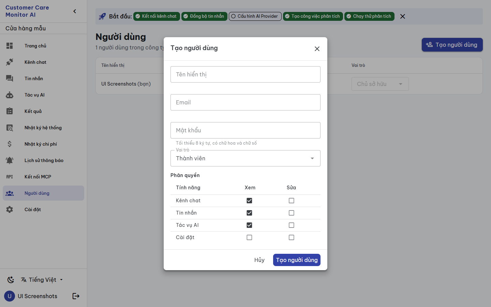
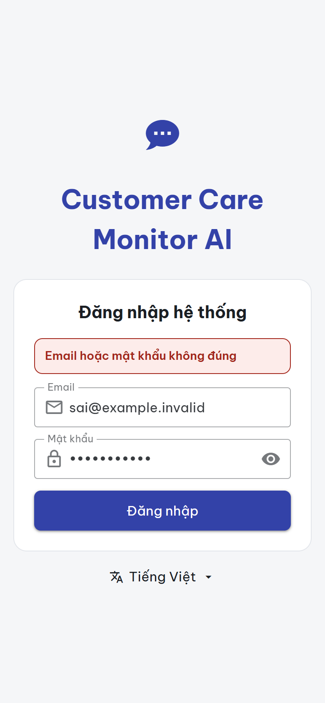

# BUILD evidence — `CCMAI-UX-014` Settings, Users, Login and Setup

**Date:** 2026-09-28 · **Worker:** Claude (`IMPLEMENTATION_WORKER`) · **Status:** `REVIEW_PENDING` for independent Codex review · **Authority:** [work order](../work_orders/CCMAI_UX_014.md), [SPEC](../specs/SETTINGS_USERS_AUTH_UX014_2026-09-28.md), canvas version `1790607141-5a73` · **Risk:** R2 · **Claim boundary:** UI structure and presentation only. The tests use a mocked API and the captures use synthetic disposable data. No provider key test, model refresh or S3 test was run, and no secret is shown.

**Independence:** only the four views and additive `st_*`/`us_*`/`au_*` keys changed. Reviewed UX-000 components are imported and not modified. The tranche does not depend on UX-012 or UX-013.

## Changed files

| File | Change |
|---|---|
| `views/Settings.vue` | Side navigation on desktop, scrollable tabs on mobile; each section is a card with an intro; token status and result notes instead of success/info alerts; the S3-off dialog on `AppDialog` with a token code block; strings moved to i18n. **A settings load failure hides every form behind an alert with "Thử lại"**, and a storage load failure hides the storage form. The key test is labelled "Kiểm tra key đã lưu" with its note. Payloads and endpoints are unchanged. |
| `views/Users.vue` | Table on desktop, cards on mobile; Vietnamese role names (values unchanged); "(bạn)" for self; a "⋯" menu (reset password, remove from company) with `ConfirmDialog`; `AppDialog` for create, permissions and reset; Vietnamese snacks; load error + retry. The create and reset password rules now match the backend: 8+ characters, an uppercase letter and a digit. |
| `views/Login.vue`, `views/Setup.vue` | Flat token card, `autocomplete` attributes, `role="alert"` errors, Setup copy in i18n with a persistent password rule. The auth flow is unchanged. |
| `i18n/vi.ts`, `en.ts` | 77 additive keys each. |
| `__tests__/settings-users-auth.spec.ts` (new) | 6 tests. |

## Defects fixed

1. **Settings could be overwritten with defaults.** `GET /settings` always returns 200 for a new tenant, so a failure means a real error. The old view swallowed that error and showed the defaults: Claude/Sonnet 5, rate 26000 and an empty company name. Any Save then wrote them. The forms are now hidden until a load succeeds.
2. **Missing translation keys:** the old storage save used `settings_saved` and `save_failed`, which do not exist, so the user saw raw key names. These now use `st_saved` and `st_save_failed`.
3. **Password rule mismatch:** the create form accepted 6 characters while the server requires 8 characters, an uppercase letter and a digit. Users could submit forms the server always rejected. The form rule now matches the server.
4. **Misleading test label:** "Kiểm tra API Key" actually tests the key saved on the server (`TestAIKey`), not the one being typed. It is now "Kiểm tra key đã lưu" with a note.
5. English snacks and role names are replaced by Vietnamese through i18n; icon-only buttons are replaced by labelled menus.

## Gates

| Gate | Result |
|---|---|
| `npx vue-tsc -b --force` | exit 0 |
| `npm run build` | exit 0 |
| `npm test` | 14 files, **151 passed** (145 + 6) |
| Mutation check | Settings load failure treated as success, and the password rule reverted to ≥ 6: both broke their tests |
| Undefined-key check | none among keys used by the four views |
| `git diff --check`, catalog `-Check`, doctor | see the commit |

## Rendered evidence (disposable Compose project, synthetic data, `ccma` untouched, removed afterwards)

- `scripts/ui-screenshots.ps1 -Mode app`: 36 pages, 0 JS errors, overflow or external requests.
- A scratch CDP plan captured 7 states at desktop/mobile × light/dark: the four Settings sections, the Users list, the create-user dialog, and Login with a wrong password (no token). Result: **28 captures, 0 JS errors, 0 overflow, 0 failed steps, 0 external requests** (`states.json`). The plan never pressed the key test, model refresh or S3 test.
- **Setup was not captured.** The disposable environment completes setup to create its admin, so `/setup` then redirects. Its presentation is covered by the canvas and a source review.
- The environment has one user and no saved AI key, so the saved-key note and member actions are covered by unit tests rather than captures.

## Held (SPEC §5)

A delete permission (`d`) for members (permission contract); a confirmation for role changes (behavior change); server-side provider URL validation.
