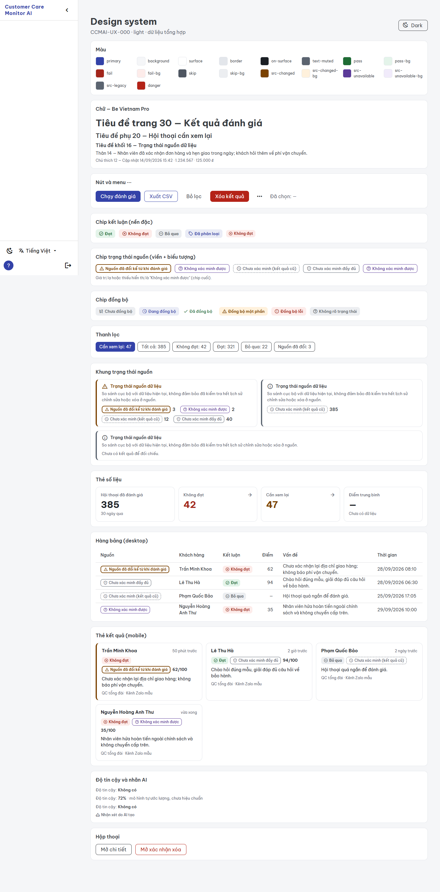
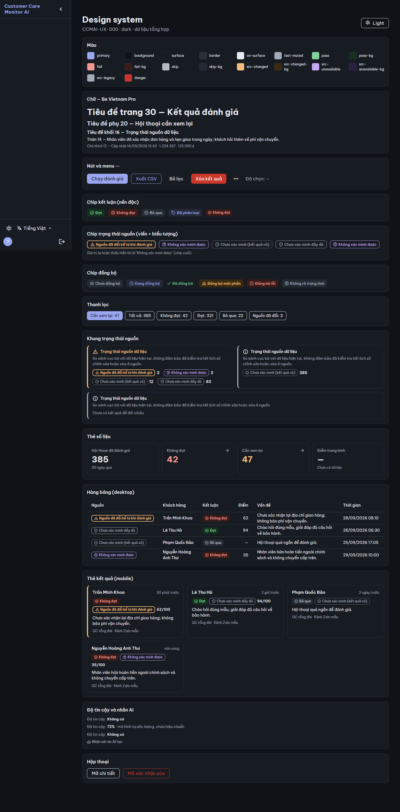
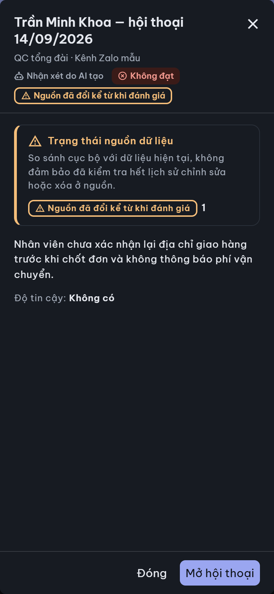
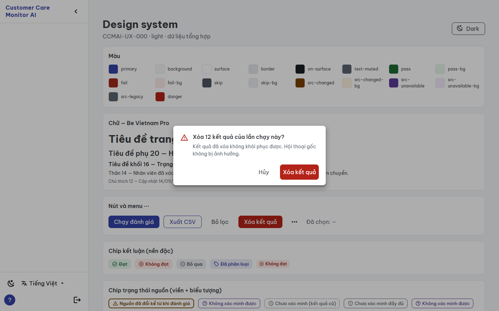
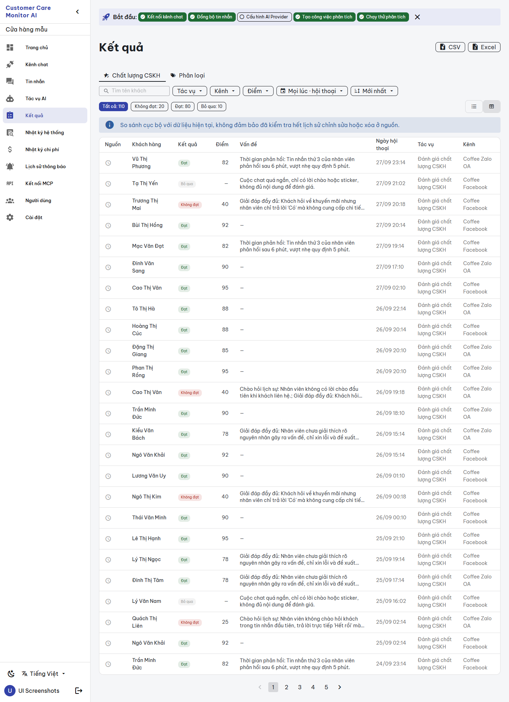
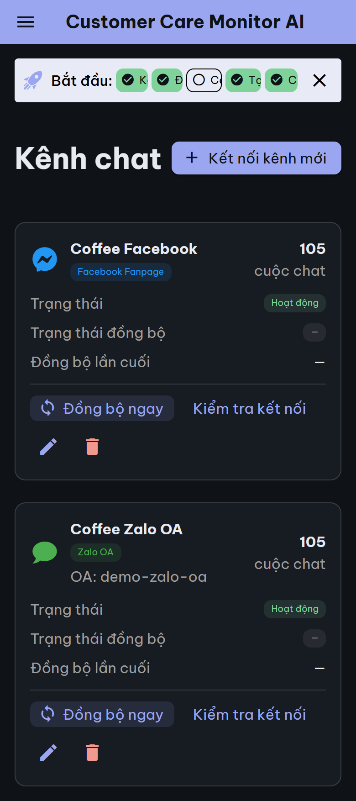

# BUILD evidence — `CCMAI-UX-000` UI foundation

**Date:** 2026-09-28 · **Implementer:** Claude (`IMPLEMENTATION_WORKER`) · **Risk:** R2 · **Status:** `REVIEW_PENDING` for independent Codex review. Not self-approved; no FREEZE.
**Authority:** [work order](../work_orders/CCMAI_UX_000.md), [SPEC](../specs/UI_FOUNDATION_UX000_2026-09-28.md), plan commit `3dce3e7`.

## What changed

| Area | Files |
|---|---|
| Theme tokens (light/dark), persisted theme | `frontend/src/styles/tokens.ts` (new), `frontend/src/plugins/vuetify.ts`, `frontend/src/layouts/DefaultLayout.vue` (two lines: import + `storeTheme` in the existing toggle) |
| Self-hosted font | `frontend/package.json` / `package-lock.json` (`@fontsource/be-vietnam-pro` ^5.3.0, OFL-1.1), `frontend/src/styles/foundation.css` (new), `frontend/src/main.ts` (one import) |
| Shared components | `frontend/src/components/ui/*.vue` + `types.ts` (12 components, all new, presentational, no API/store access) |
| Helpers | `frontend/src/utils/format.ts`, `frontend/src/utils/review.ts` (new) |
| i18n | 19 new `ui_*` keys in both `vi.ts` and `en.ts` (additions only) |
| Preview route | `frontend/src/router/index.ts` (+1 static route), `frontend/src/wireframes/DesignSystem.vue` (new) |
| Tests / tooling | 4 new spec files; `vite.config.ts` (vitest `server.deps.inline: ['vuetify']`), `test` script |
| Screenshot tool | `scripts/ui-screenshots.mjs`, `scripts/ui-screenshots.ps1`, `scripts/ui-screenshots/compose.yml` (new) |
| Docs | `docs/reference/UI_GLOSSARY.md`, `docs/reference/UI_SCREENSHOTS.md` (new) |

No backend, API, model, migration, store (`frontend/src/stores/**`) or existing view file changed. `stores/jobs.ts` constants are imported, not edited.

## SPEC deviations (recorded, within scope)

1. **Font subsets (SPEC F1).** The SPEC named `vietnamese` + `latin`. The package's per-subset files carry no `unicode-range`, so importing two of them for one weight makes the later one win for every glyph. BUILD imports the per-weight files (`400/500/600/700.css`), which declare `vietnamese`, `latin-ext` and `latin` with `unicode-range`; the browser downloads only the subsets a page uses. Still fully bundled, no CDN.
2. **Explicit `on-*` colors.** The first app capture showed Vuetify auto-picking white text on the dark-theme primary `#9AA6F0` (mobile app bar, "Kết nối kênh mới" button, ~2.2:1). Tokens now set `on-primary/secondary/success/error/warning/info/danger` explicitly (dark theme: `#0F1217` text on light fills), and the contrast test covers every `on-X`/`X` pair in both themes. Recaptured evidence shows the fix.
3. **Chip radius.** Vuetify `VChip` default is now `rounded="lg"` (8px) per the design decision, which changes existing pill chips to 8px corners app-wide.

## Semantics encoded (review checklist, SPEC §3)

- `SourceStatusChip` / `countSourceStatuses`: missing or unknown status → `verification_unavailable`; labels reuse the reviewed R004 keys; no green, no check icon; `changed_since_analysis` uses the warning triangle and a heavier border.
- `SourceStatusPanel`: always renders `results_source_note`; no prop hides it; counts in `SOURCE_INTEGRITY_ORDER`.
- `ConfidenceText` / `confidencePercent`: a percentage only for basis `model_reported_uncalibrated` and a finite value in [0,1], always followed by "mô hình tự ước lượng, chưa hiệu chuẩn"; everything else "Không có".
- `SyncStatusChip` / `syncKind`: `syncing` labelled "Đang đồng bộ" with tooltip "Đã bắt đầu đồng bộ, chưa hoàn tất."; unknown values never read as success.
- `MetricCard`: `null` → "—", never 0; drill-down renders a real `<a>`.
- `verdictFromSeverity`: only `PASS` → pass and `SKIP` → skip; anything else is fail (same as current `Results.vue`).
- `ActionMenu`: emits the key only; danger items listed last; 44×44 trigger with accessible label. `ConfirmDialog` never acts on its own.

## Gates

| Gate | Command | Result |
|---|---|---|
| Type-check (full, not incremental) | `npx vue-tsc -b --force` (frontend) | exit 0 |
| Build | `npm run build` | built; 24 Be Vietnam Pro font files in `dist/assets`; no `fonts.googleapis`/`gstatic` reference in `dist` or `index.html` |
| Unit/component tests | `npm test` (`vitest run`) | 5 files, **78 passed** (format 4, review 6, theme 47, components 13, existing i18n 8 — the i18n `vi`/`en` parity test still passes) |
| Mutation check | temporarily (a) mapped unknown source status to `bound_currentness_unverified`, (b) hid the panel note when empty, (c) removed the confidence basis check | (a) 6 failures, (b) 1 failure, (c) 2 failures; source restored and the suite green again |
| Diff hygiene | `git diff --check` | clean (only the known `core.autocrlf` notices) |
| Script syntax | `node --check scripts/ui-screenshots.mjs` | ok |
| Catalog / doctor | `scripts/manage_cvf_downstream_catalog.ps1 -Check`; `../.Controlled-Vibe-Framework-CVF/scripts/check_cvf_workspace_agent_enforcement.ps1 -ProjectPath <root>` | catalog PASS; doctor PASS 25/25 (after continuity sync) |

An early disposable image build failed at `vue-tsc` because the component spec had loose `never` typing, which the local incremental build had not re-checked. Fixed the typing and switched the local gate to `vue-tsc -b --force`.

## Screenshots

Tool: `scripts/ui-screenshots.ps1` (see [UI_SCREENSHOTS.md](../reference/UI_SCREENSHOTS.md)). Desktop 1440×900, mobile 390×844, light and dark.

| Run | Pages | JS errors | Horizontal overflow | External requests |
|---|---|---|---|---|
| `-Mode preview` (`/wireframes/design-system` + review dialog + confirm dialog) | 12 | 0 | 0 | none |
| `-Mode app` (dashboard, channels, channel detail, messages, jobs, QC and classification job detail, results, settings) | 36 | 0 | 0 | none |

Committed subset in [`assets/ux-000-2026-09-28/`](./assets/ux-000-2026-09-28/) with both `report-*.json` files:

Mobile light/dark design-system captures and Job Detail captures are in the same folder.

**Disposable environment check.** A `-KeepEnvironment` run was queried before teardown: the Results API returned 210 rows — 208 `legacy_unverified`, 1 `changed_since_analysis`, 1 `verification_unavailable` — and the disposable DB held 2 synthetic snapshots bound to 4 result rows. So the seed produces exactly the intended states. After every run, `docker ps -a`, `docker volume ls` and `docker images` show no `ccma-uishot-*` leftovers; the temp env/token files are deleted. The persistent `ccma-app-1`, `ccma-db-1` and `ccma-nginx-1` kept their uptimes throughout (not restarted or touched).

## Contrast and touch targets

- Theme test computes WCAG ratios from the token objects: every status text/background pair, outlined source chips on surface/background, muted text, primary as text, and every `on-X` on `X` fill in both themes ≥ 4.5:1 (47 theme tests).
- 44px: `ActionMenu` trigger (asserted in test), `AppDialog` close button (`size="44"`), `ConfirmDialog` buttons (`size="large"`), `ResultCard` (min-height 44px, whole card is a button). Chips are not interactive in the components.

## Findings for later tranches (not fixed here — outside the work order)

- **F1** `OnboardingWizard.vue` hard-codes `color="indigo-lighten-5"`, so the "Bắt đầu" bar stays light in dark mode. Legible (dark text on light), but inconsistent. → Dashboard screen tranche (with UX-11/UX-19).
- **F2** `DefaultLayout.vue` avatar initials use `class="text-white"` on `color="primary"`; in dark mode that is white on `#9AA6F0` (~2.2:1). → layout/shell tranche; replace with theme `on-primary`.
- **F3** Existing views still use the old `SOURCE_INTEGRITY_STYLE` (changed = red icon) and their own sync labels. They switch to the shared components in their screen tranches (`CCMAI-UX-010+`); UX-000 intentionally leaves view logic unchanged.
- **Observation for UX-001c:** freshly imported demo channels show an empty sync status ("—"), not "Lỗi" as in the baseline, so the baseline `error` is written later (for example by a scheduled sync attempt), not by the demo import.

## Boundaries

No AI provider call (pure UI tranche). No real channel sync, customer data, persistent `ccma` Compose/DB change, deployment or push. The design-system route is a static wireframe with synthetic data. This evidence makes no CVF governance claim.

## Addendum A1 — screenshot tool chart artifact (same-scope repair before review, 2026-09-28)

While capturing UX-001a evidence, every Chart.js chart (Job Detail trend, dashboard daily charts) showed its points bunched against the left edge, although the axis spanned the full width. The 2026-09-27 baseline (different capture method) rendered the same charts correctly, and a 9-second wait did not help, so this was a capture artifact, not a product defect or an animation timing issue. Cause: `Page.captureScreenshot` with `captureBeyondViewport: true` resizes the viewport at capture time; Chart.js's resize observer then redraws and is caught mid-redraw.

Fix in `scripts/ui-screenshots.mjs` (UX-000 scope): keep the target focused (`Page.bringToFront`, focus emulation), grow the device-metrics viewport to the full page height, wait 1.5 s, then capture without `captureBeyondViewport`. Verified on a kept disposable environment: Job Detail trend and dashboard charts render correctly at desktop and mobile. A side effect is that full-height captures now also show the navigation drawer at full height.

The four committed `app-*.png` files and `report-app.json` in `assets/ux-000-2026-09-28/` were recaptured with the fixed tool (36 pages, 0 JS errors, 0 horizontal overflow, no external requests; disposable project removed). That tree also contains the committed `CCMAI-UX-002` Results change, so the Results image shows its note; UX-001a work was stashed during the capture and is not in these images. The design-system preview images were unaffected (no charts) and are unchanged. Earlier statements in this document about the app captures still hold; only the chart rendering in the images changed.
