# Đánh giá UI/UX nền tảng — cơ sở cho redesign

**Ngày:** 2026-09-27 · **Người đánh giá:** Claude (theo yêu cầu của owner) · **Phiên bản:** mã nguồn tại commit `3a41252` (sau R001–R007) · **Loại tài liệu:** đánh giá hiện trạng, *không* phải SPEC hay work order. Mỗi nhóm sửa đổi cần SPEC/WORK_ORDER riêng trước khi BUILD.

## Mục đích

Ghi lại hiện trạng giao diện của Customer Care Monitor AI để làm mốc so sánh cho các đợt redesign UI/UX. Tài liệu liệt kê lỗi hiển thị sai dữ liệu, khoảng trống về giới hạn tuyên bố (claim boundary) của các tranche runtime, vấn đề mobile và thiếu nhất quán, kèm ảnh chụp thật của từng màn hình.

## Cách đánh giá

- Môi trường review **tách biệt, dùng một lần**: image `ccma-app` build từ mã hiện tại + MySQL tạm + tài khoản admin tạm + dữ liệu demo (2 kênh, 210 hội thoại, 2 tác vụ, 385 kết quả). Môi trường thật `localhost:8088` không bị động tới. Toàn bộ môi trường review và tài khoản tạm đã xóa sau khi chụp.
- Dữ liệu demo không gắn snapshot nên mọi kết quả đều là "kết quả cũ". Để xem được các trạng thái nguồn khác, đã thêm **một snapshot tổng hợp chỉ trong DB review**, ghi nhận một tin nhắn không còn tồn tại, nên kết quả của Quách Thị Liên hiển thị "Nguồn đã đổi" và nhóm của cô ấy có trạng thái hỗn hợp.
- Chụp bằng Chrome headless qua DevTools Protocol ở hai kích thước: desktop 1440×900 và mobile 390×844. **0 lỗi JavaScript** trên tất cả các trang.
- Ảnh chụp phản ánh dữ liệu demo tại `3a41252`, còn thương hiệu kế thừa "SePay Coffee". Commit `b687c70` sau đó đã bỏ thương hiệu này khỏi dữ liệu demo; tên kênh/nhân viên trong ảnh vì vậy không phải là phát hiện.
- Giới hạn: đánh giá bằng ảnh tĩnh và đọc mã nguồn. Chưa thử thao tác thực tế bằng bàn phím, trình đọc màn hình, dark mode, tiếng Anh, hoặc dữ liệu thật từ kênh chat.

## Ảnh chụp

Ảnh gốc nằm trong `assets/ui-ux-review-2026-09-27/`. Mã UX-xx cho biết phát hiện nào có thể thấy trong ảnh.

### Đăng nhập (desktop)

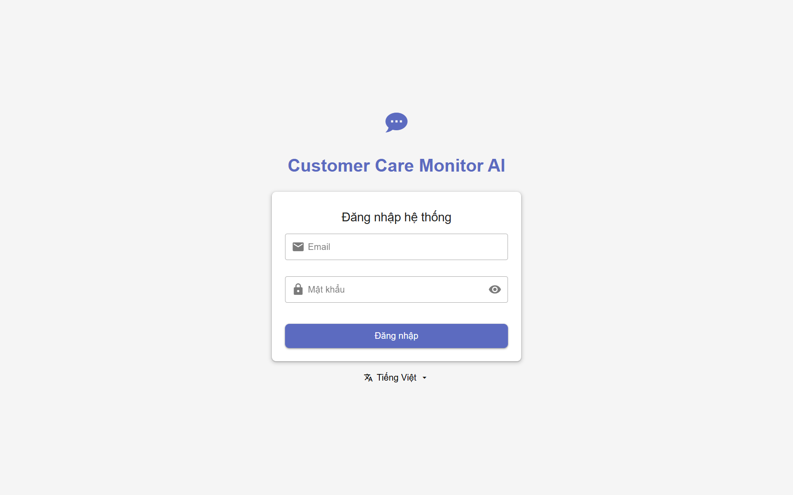

### Trang chủ (desktop) — UX-01, UX-02, UX-15, UX-19

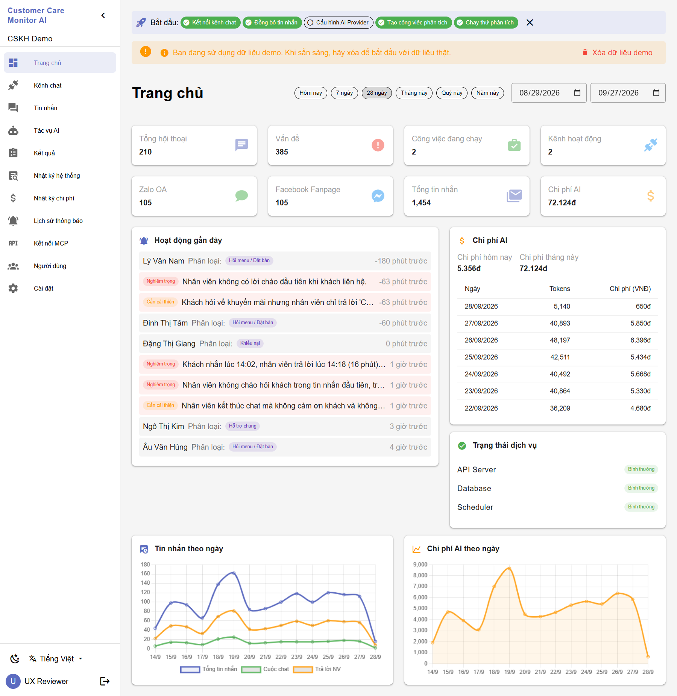

### Trang chủ (mobile 390px) — UX-11

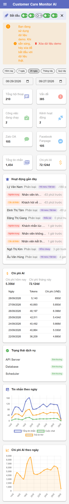

### Kênh chat — UX-06, UX-20

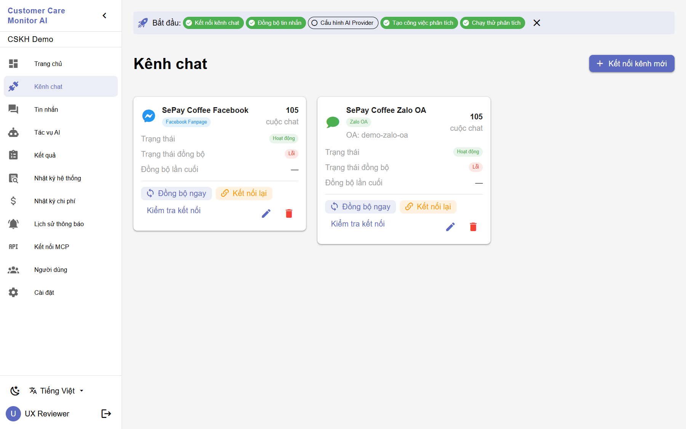

### Tin nhắn — UX-16

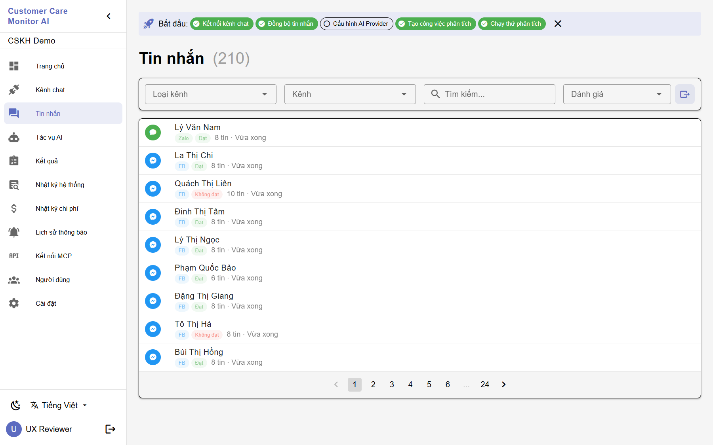

### Danh sách tác vụ — UX-12, UX-13, UX-14

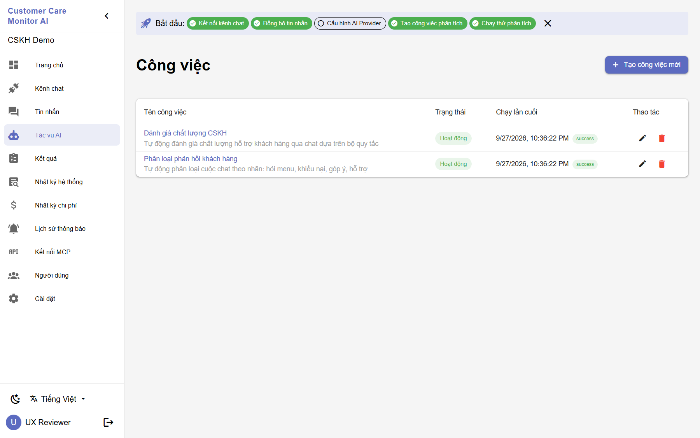

### Job Detail QC, dạng thẻ — UX-04, UX-05, UX-08

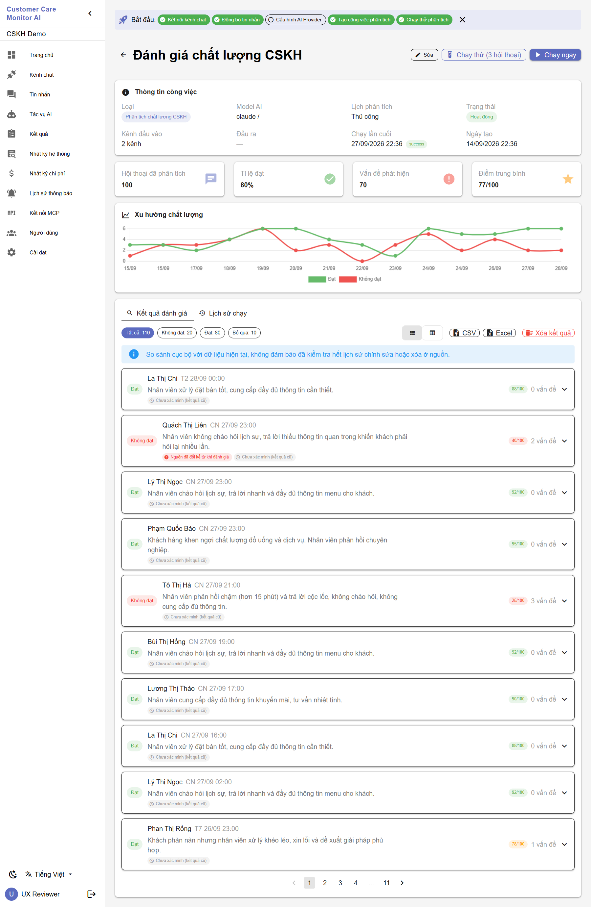

### Job Detail QC, dạng bảng — UX-09, UX-18

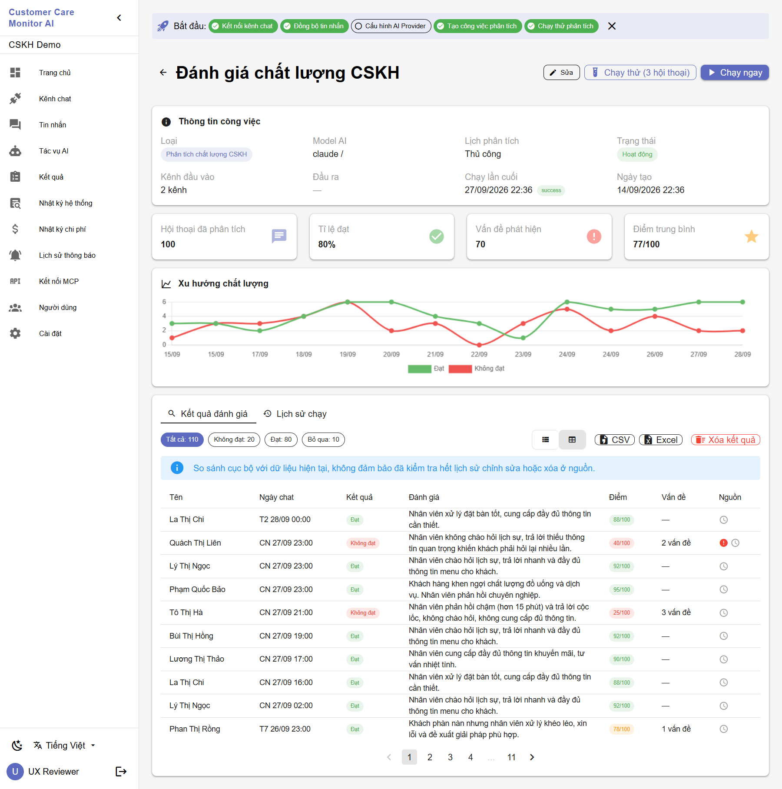

### Job Detail QC, hộp thoại — UX-17

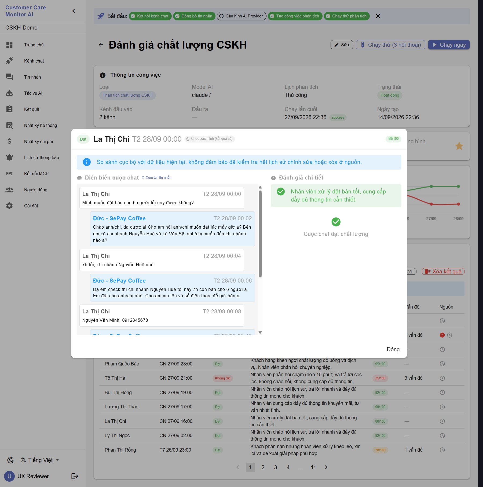

### Job Detail QC (mobile 390px) — UX-10

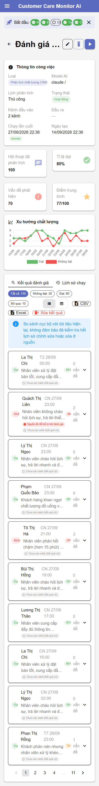

### Job Detail phân loại — UX-03

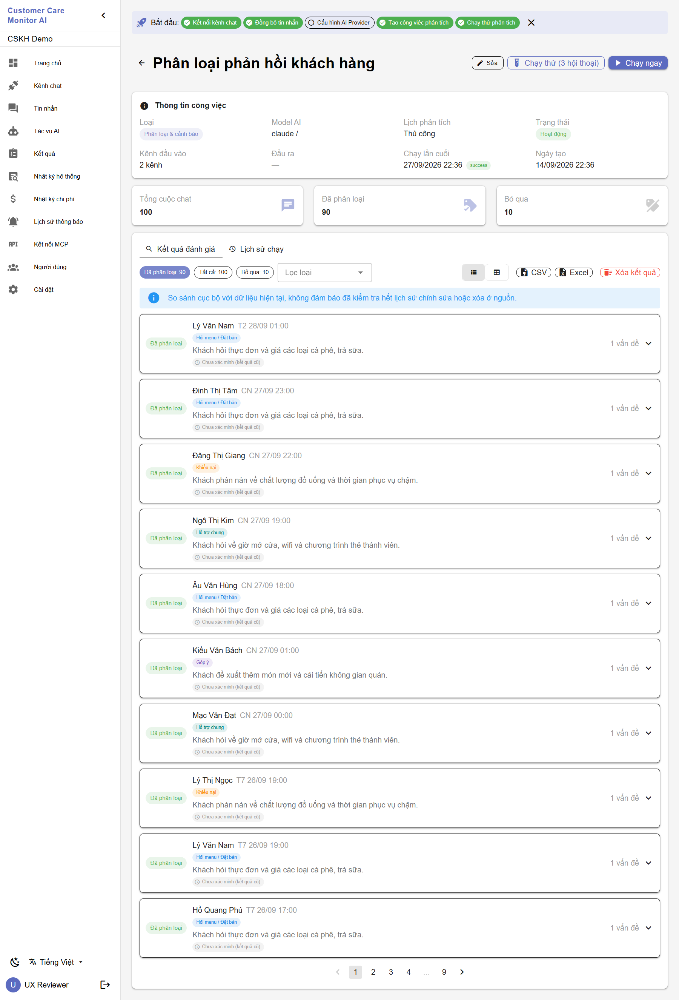

### Kết quả tổng hợp — UX-07

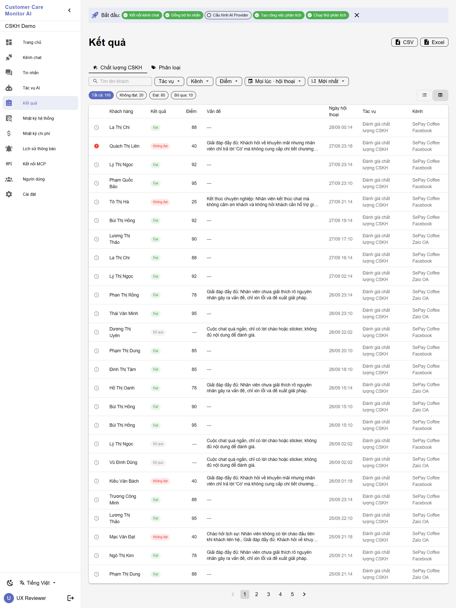

### Kết quả, hộp thoại

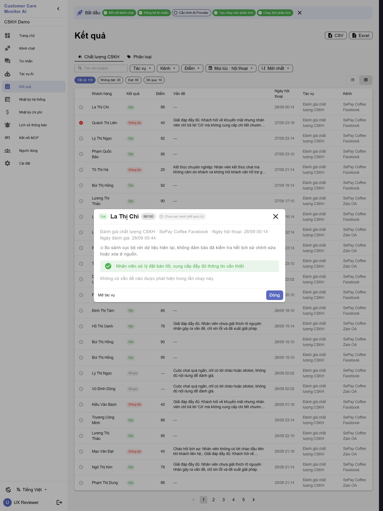

### Kết quả (mobile 390px) — mẫu tốt cho mobile

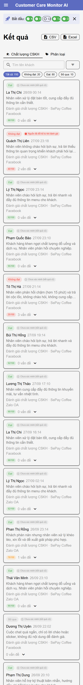

### Cài đặt

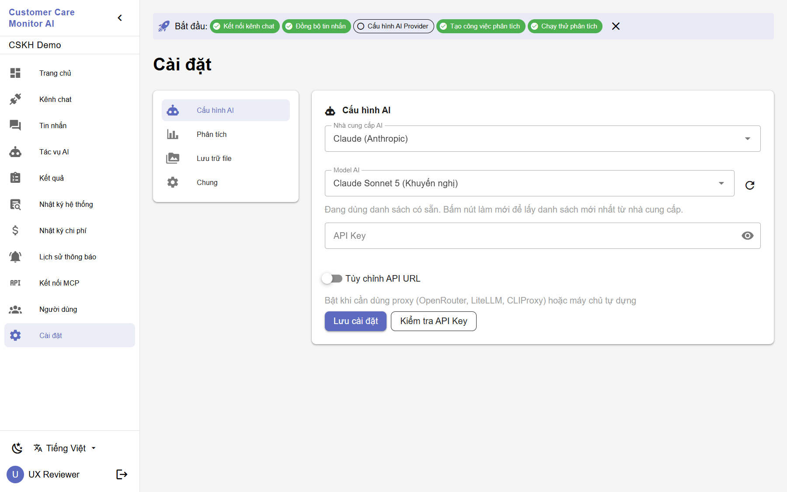

## Phát hiện

Mức độ: **P1** hiển thị dữ liệu sai hoặc gây hiểu nhầm · **P2** khoảng trống giới hạn tuyên bố hoặc hỏng bố cục · **P3** nhất quán và trau chuốt.

### A. Dữ liệu hiển thị sai hoặc gây hiểu nhầm

| ID | Mức | Màn hình | Hiện trạng | Nguyên nhân đã xác định | Hướng xử lý |
|---|---|---|---|---|---|
| UX-01 | P1 | Trang chủ, "Hoạt động gần đây" | Thời gian âm: "-180 phút trước", "-63 phút trước". Quá 60 phút vẫn ghi theo phút. | `timeAgo()` trong `frontend/src/views/Dashboard.vue` không xử lý thời điểm trong tương lai. Dữ liệu demo đặt thời điểm đánh giá = tin nhắn cuối + 30 phút nên có thể nằm trong tương lai. | Chặn giá trị âm ("vừa xong"), dùng giờ khi ≥ 60 phút, và cho dữ liệu demo không sinh thời điểm tương lai. |
| UX-02 | P1 | Trang chủ, thẻ "Vấn đề" | Hiển thị 385, tức là **tổng số kết quả** (đánh giá + nhãn + vi phạm), không phải số vấn đề. | `backend/api/handlers/dashboard.go` đếm mọi `job_results`; chính mã nguồn ghi chú rằng chỉ `qc_violation` là vấn đề thật. | Chỉ đếm `qc_violation`, hoặc đổi tên thẻ cho đúng nội dung. |
| UX-03 | P1 | Job Detail phân loại | Mỗi dòng ghi "1 vấn đề", nhưng với phân loại đó là số nhãn. | Dùng chung nhãn "vấn đề" cho cả QC và phân loại. | Với phân loại hiển thị "N nhãn". |
| UX-04 | P1 | Job Detail QC | "Tất cả: 110" lệch với "Hội thoại đã phân tích: 100". | Bộ lọc đếm nhóm theo lần chạy mới nhất; thẻ thống kê đọc tóm tắt lần chạy. Hai nguồn số liệu khác nhau. | Thống nhất một nguồn, hoặc ghi rõ phạm vi của từng số. |
| UX-05 | P1 | Job Detail, "Xu hướng chất lượng" | Trục ngày lặp (15/09 hai lần, 24/09 hai lần), thiếu 16/09 và 25/09. | Có khả năng gom nhóm theo ngày bị lệch múi giờ (chưa xác minh trong mã). | Gom nhóm theo ngày giờ Việt Nam (+07:00) và có kiểm thử. |
| UX-06 | P1 | Kênh chat | Hai kênh demo hiển thị "Trạng thái đồng bộ: Lỗi" dù "Đồng bộ lần cuối: —". | Nhãn "Lỗi" tương ứng `last_sync_status = error`. Chưa xác định vì sao kênh demo có trạng thái này (dữ liệu demo không đặt giá trị đó). | Tìm nguồn ghi `error`. Kênh chưa từng đồng bộ nên hiển thị "Chưa đồng bộ". |

### B. Khoảng trống giới hạn tuyên bố (liên quan tranche runtime)

| ID | Mức | Màn hình | Hiện trạng | Hướng xử lý |
|---|---|---|---|---|
| UX-07 | P2 | Kết quả (R004), desktop và mobile | Lời giải thích "chỉ so sánh cục bộ" chỉ xuất hiện trong hộp thoại, không có phía trên danh sách. Cột biểu tượng nguồn không có tiêu đề. Đây đúng là lỗi Codex đã yêu cầu sửa ở Job Detail (R006-R1). | Tranche sửa R004 nhỏ: đặt `results_source_note` trên danh sách và thêm tiêu đề cột "Nguồn". |
| UX-08 | P2 | Job Detail, Kết quả | Mỗi dòng có chip xám "Chưa xác minh (kết quả cũ)", rất rối mắt. Khi hầu hết là kết quả cũ, chip đỏ "Nguồn đã đổi" hiếm gặp bị lấn át. | Một dòng tóm tắt ("110 kết quả cũ chưa xác minh"); chip theo dòng chỉ cho trạng thái đã đổi hoặc không xác minh được. **Thay đổi yêu cầu SPEC R004/R006**, cần Codex đồng ý. |
| UX-09 | P3 | Job Detail, Kết quả | Chữ trong chip trạng thái rất nhỏ (~9px). Ở dạng bảng chỉ có biểu tượng, phải rê chuột mới đọc được. | Tăng cỡ chữ và có nhãn ngắn hiển thị sẵn cho trạng thái quan trọng. |

Hoạt động đúng thiết kế: nhóm hỗn hợp (Quách Thị Liên) hiện cả "Nguồn đã đổi" và "Chưa xác minh (kết quả cũ)", thứ tự nghiêm trọng trước. Lời giải thích cục bộ hiển thị ở cả dạng thẻ và bảng của Job Detail (sau R006-R1).

### C. Mobile (390px)

| ID | Mức | Màn hình | Hiện trạng | Hướng xử lý |
|---|---|---|---|---|
| UX-10 | P2 | Job Detail | Tiêu đề bị cắt "Đánh giá …". Thẻ kết quả bị ép: kết luận "Đạ"/"Khô", điểm "88/1", "0 vấn đề" xuống 3 dòng, tên khách xuống dòng. Nút hành động chỉ còn biểu tượng. | Bố cục thẻ xếp chồng trên màn hình hẹp; tiêu đề cho phép xuống dòng. |
| UX-11 | P2 | Trang chủ | Banner demo xuống dòng từng chữ do nút "Xóa dữ liệu demo" nằm cùng hàng. Chip hướng dẫn bắt đầu bị cắt ("K", "Đ"). Hàng hoạt động gần đây tràn ngang. | Nút xuống hàng dưới trên mobile; chip cuộn ngang hoặc thu gọn; cắt chữ có dấu "…". |
| — | OK | Kết quả | Đã tự chuyển sang dạng thẻ và dễ đọc. | Dùng làm mẫu cho Job Detail. |

### D. Nhất quán và trau chuốt

| ID | Mức | Vị trí | Hiện trạng | Hướng xử lý |
|---|---|---|---|---|
| UX-12 | P3 | Danh sách tác vụ, bộ chọn ngày | Kiểu Mỹ "9/27/2026, 10:36:22 PM"; bộ chọn ngày MM/DD/YYYY; nơi khác dùng dd/mm. | Thống nhất dd/mm/yyyy, 24 giờ, theo ngôn ngữ đang chọn. |
| UX-13 | P3 | Thanh bên và tiêu đề | "Tác vụ AI" / "Công việc" / "Công việc đang chạy" cùng chỉ một khái niệm. | Chọn một thuật ngữ và áp dụng toàn bộ. |
| UX-14 | P3 | Tác vụ, Job Detail | Chip tiếng Anh "success"; "Model AI: claude /" khi chưa chọn model; "Đầu ra: —". | Dịch nhãn trạng thái; ẩn dấu "/" khi thiếu model; ghi "Chưa cấu hình". |
| UX-15 | P3 | Trang chủ | Token dùng "5,140" nhưng tiền dùng "5.356đ". | Định dạng số theo ngôn ngữ. |
| UX-16 | P3 | Tin nhắn | Tiêu đề "Tin nhắn (210)" nhưng 210 là số hội thoại. | "Hội thoại (210)" hoặc đếm đúng tin nhắn. |
| UX-17 | P3 | Hộp thoại Job Detail | Không có nút X ở góc (hộp thoại Kết quả có). | Thống nhất có nút đóng ở góc. |
| UX-18 | P3 | Job Detail | "Xóa kết quả" màu đỏ nằm ngay cạnh CSV/Excel, dễ bấm nhầm. | Tách xa hoặc đưa vào menu, và luôn có xác nhận. |
| UX-19 | P3 | Hướng dẫn bắt đầu, banner demo | "Cấu hình AI Provider" chưa tích nhưng "Chạy thử phân tích" đã tích. Banner demo có hai biểu tượng "!". | Bước sau không hoàn thành khi bước trước chưa xong; bỏ biểu tượng trùng. |
| UX-20 | P3 | Kênh chat | Hai thẻ kênh cao khác nhau; "Kết nối lại" màu cam trông như cảnh báo cho mọi kênh. | Chiều cao đồng đều; chỉ nhấn mạnh "Kết nối lại" khi thật sự cần. |

### Điểm tốt nên giữ

- Màn hình đăng nhập gọn, rõ.
- Thanh bên dễ hiểu, bố cục trang có trình tự hợp lý (thông tin → số liệu → biểu đồ → danh sách).
- Hộp thoại Job Detail đặt diễn biến cuộc chat cạnh đánh giá chi tiết, rất dễ đối chiếu.
- Chip lọc kèm số lượng dễ dùng.
- Không có lỗi JavaScript trên tất cả các trang đã chụp.

## Thứ tự ưu tiên đề xuất cho redesign

1. **Dữ liệu sai** (UX-01 đến UX-06): sửa trước vì người dùng có thể đưa ra quyết định sai từ số liệu.
2. **Giới hạn tuyên bố của R004** (UX-07): một tranche sửa nhỏ, cùng loại với R006-R1.
3. **Mobile** (UX-10, UX-11): lấy màn Kết quả mobile làm mẫu.
4. **Giảm nhiễu trạng thái nguồn** (UX-08, UX-09): cần Codex đồng ý thay đổi SPEC.
5. **Nhất quán** (UX-12 đến UX-20): gom thành một đợt chuẩn hóa thuật ngữ, định dạng và thành phần giao diện.

## Nguyên tắc cho redesign

- Mọi con số trên màn hình phải có nhãn đúng với cách tính; hai số cùng tên phải cùng nguồn.
- Không để trạng thái bình thường làm chìm cảnh báo; cảnh báo nghiêm trọng luôn đứng trước.
- Giới hạn "chỉ so sánh cục bộ" phải thấy được ở mọi màn hình chính hiển thị trạng thái nguồn, không chỉ trong hộp thoại.
- Thiết kế mobile trước cho các màn danh sách; không ép thẻ desktop vào 390px.
- Một thuật ngữ cho một khái niệm; ngày giờ và số theo ngôn ngữ đang chọn.
- Chạy lại cùng bộ ảnh chụp (desktop + mobile) sau mỗi đợt redesign để so sánh với mốc này.

## Ranh giới

Tài liệu này không cấp quyền BUILD và không thay đổi trạng thái của tranche nào (R001–R006 vẫn REVIEW PASS / FREEZE mở; R007 vẫn REVIEW_PENDING). Không gọi provider AI, không dùng kênh thật hay dữ liệu khách hàng, và không phải bằng chứng quản trị CVF trực tiếp.
